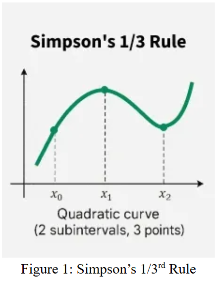

# Simpson's 1/3ʳᵈ Rule

## Theory

Simpson's 1/3 Rule is part of the Newton-Cotes family of numerical integration formulas. It is based on replacing a function with a polynomial that passes through evenly spaced points. Polynomials are used because they are simple to integrate.

**Goal:** Approximate definite integrals when the exact integral is difficult or impossible to compute analytically.

### Classification:
Simpson's 1/3 Rule is a **closed-form Newton-Cotes formula** (endpoints included) that uses **3 points** to fit a **quadratic polynomial** through equally spaced data points.



### Key Properties:
- Uses **3 equally spaced points** (requires even number of intervals)
- Approximates the curve with a second-degree (quadratic) polynomial
- Works best when the function is smooth and the interval count is even

### Formula:
```
∫ₐᵇ y dx = (h/3) × [(y₀ + yₙ) + 4(y₁ + y₃ + ⋯ + yₙ₋₁) + 2(y₂ + y₄ + ⋯ + yₙ₋₂)]
```

Where:
- **h** = interval width = (b - a) / n
- **b** = upper limit of integration
- **a** = lower limit of integration
- **n** = number of equal parts (must be even)
- **y₀, y₁, y₂, ..., yₙ** = function values at equally spaced points


---

## Algorithm

**Step 1:** Read the number of intervals **n** (must be even), lower limit **a**, and upper limit **b**

**Step 2:** Calculate the interval width: **h = (b - a) / n**

**Step 3:** Calculate function values at all points:
- y₀ = f(a)
- y₁ = f(a + h)
- y₂ = f(a + 2h)
- ...
- yₙ = f(b)

**Step 4:** Separate the function values:
- sum₁ = y₀ + yₙ (first and last)
- sum₂ = 4 × (y₁ + y₃ + y₅ + ... + yₙ₋₁) (odd-indexed values)
- sum₃ = 2 × (y₂ + y₄ + y₆ + ... + yₙ₋₂) (even-indexed values except endpoints)

**Step 5:** Apply Simpson's 1/3 formula:
```
Result = (h/3) × (sum₁ + sum₂ + sum₃)
```

**Step 6:** Output the result

---

## Input/Output Example

### Input Format:
```
n a b
```

### Input:
```
6 0 3
```
**Explanation:**
- **n = 6** : Number of intervals (must be even)
- **a = 0** : Lower limit of integration
- **b = 3** : Upper limit of integration
- Function integrated: f(x) = 1/(1+x²)

### Output:
```
f(x) = 1/(1+x^2)
a = 0, b = 3, n = 6, h = 0.5
Result = 1.247082
```
**Explanation:**
- Interval width h = (3-0)/6 = 0.5
- Points: x₀=0, x₁=0.5, x₂=1.0, x₃=1.5, x₄=2.0, x₅=2.5, x₆=3.0
- Applied Simpson's 1/3 formula: ∫₀³ 1/(1+x²) dx ≈ 1.247082


---

## Code Constraints

- **Input Format**: Must provide exactly 3 values: n, a, b
- **Interval Count**: **n must be even** (required for Simpson's 1/3 Rule)
- **Limits**: **a < b** (lower limit must be less than upper limit)
- **Interval Width**: **h = (b-a)/n must be > 0**
- **File Dependency**: Requires input.txt in **../Input/** directory
- **Function**: Currently hardcoded as f(x) = 1/(1+x²) in code

