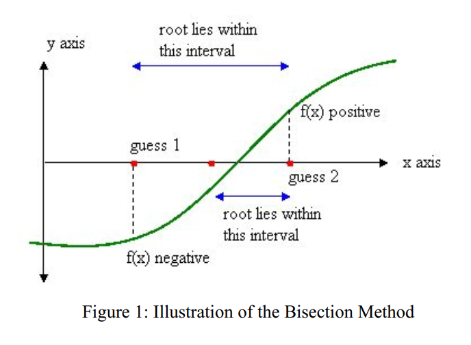
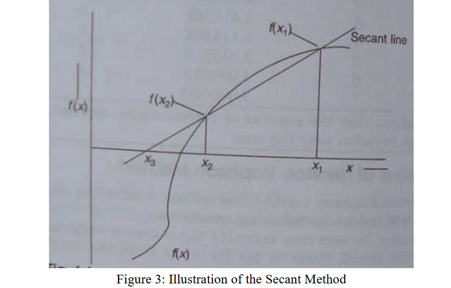
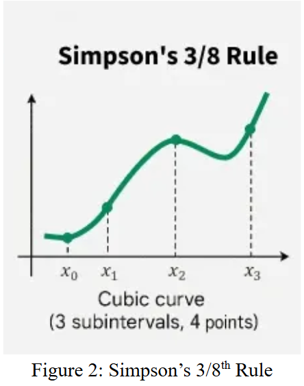

# Numerical Methods Project

A collection of numerical methods implemented in C++ for solving various mathematical problems including linear equations, non-linear equations, interpolation, integration, differential equations, and curve fitting.

---

## Table of Contents

1. [Non-Linear Equations](#non-linear-equations)
2. [Linear Equations](#linear-equations)
3. [Interpolation Methods](#interpolation-methods)
4. [Integration Methods](#integration-methods)
5. [Differential Equations](#differential-equations)
6. [Curve Fitting - Regression](#curve-fitting---regression)

---

## Project Members
| Name | Roll | Year | Term | Group |
|------|------|------|------|-------|
| Md. Taki Tahmid Saad | 2207022 | 2nd | 2nd | A1 |
| Saleh Sadid Mir | 2207024 | 2nd | 2nd | A1 |
| Md Sadikul Islam Siyam | 2207031 | 2nd | 2nd | A2 |
---

## Non-Linear Equations

Methods for finding roots of equations of the form f(x) = 0.

| Method | Theory | Code | Input | Output |
|--------|--------|------|-------|--------|
| **Bisection Method** | [View](#bisection-method) | [View](#code-4) | [View](#inputoutput-example-4) | [View](#output-4) |
| **False Position Method** | [View](#false-position-method-regula-falsi) | [View](#code-5) | [View](#inputoutput-example-5) | [View](#output-5) |
| **Newton Raphson Method** | [View](#newton-raphson-method) | [View](#code-6) | [View](#inputoutput-example-6) | [View](#output-6) |
| **Secant Method** | [View](#secant-method) | [View](#code-8) | [View](#inputoutput-example-7) | [View](#output-7) |

---

## Linear Equations

Methods for solving systems of linear equations (AX = B).

| Method | Theory | Code | Input | Output |
|--------|--------|------|-------|--------|
| **Gauss Elimination Method** | [View](#gauss-elimination-method) | [View](#code) | [View](#inputoutput-example) | [View](#output) |
| **Gauss Jordan Method** | [View](#gauss-jordan-method) | [View](#code-1) | [View](#inputoutput-example-1) | [View](#output-1) |
| **LU Decomposition Method** | [View](#lu-decomposition-method) | [View](#code-3) | [View](#inputoutput-example-3) | [View](#output-3) |
| **Inverse Matrix Method** | [View](#inverse-matrix-method) | [View](#code-2) | [View](#inputoutput-example-2) | [View](#output-2) |

---

## Interpolation Methods

Methods for estimating values between known data points.

| Method | Theory | Code | Input | Output |
|--------|--------|------|-------|--------|
| **Newton's Forward & Backward Interpolation** | [View](#newtons-interpolation-methods) | [View](#code-13) | [View](#inputoutput-example-12) | [View](#output-12) |
| **Differentiation using Newton's Interpolation** | [View](#numerical-differentiation-using-newtons-interpolation-method) | [View](#code-12) | [View](#inputoutput-example-11) | [View](#output-11) |

---

## Integration Methods

Numerical methods for finding definite integrals.

| Method | Theory | Code | Input | Output |
|--------|--------|------|-------|--------|
| **Simpson's 1/3 Rule** | [View](#simpsons-13ʳᵈ-rule) | [View](#code-10) | [View](#inputoutput-example-9) | [View](#output-9) |
| **Simpson's 3/8 Rule** | [View](#simpsons-38ᵗʰ-rule) | [View](#code-11) | [View](#inputoutput-example-10) | [View](#output-10) |

---

## Differential Equations

Methods for solving ordinary differential equations (ODEs).

| Method | Theory | Code | Input | Output |
|--------|--------|------|-------|--------|
| **Runge-Kutta Method (RK4)** | [View](#runge-kutta-method-rk4) | [View](#code-9) | [View](#inputoutput-example-8) | [View](#output-8) |


---

## Curve Fitting - Regression

Least square regression methods for fitting curves to experimental data.

| Type | Theory | Code | Input | Output |
|------|--------|------|-------|--------|
| **Linear Equation** | [View](#linear-equation-least-square-regression) | [View](#code-14) | [View](#inputoutput-example-13) | [View](#output-13) |
| **Polynomial Equation** | [View](#polynomial-equation-least-square-regression) | [View](#code-15) | [View](#inputoutput-example-14) | [View](#output-14) |
| **Transcendental Equation** | [View](#transcendental-equation-least-square-regression) | [View](#code-16) | [View](#inputoutput-example-15) | [View](#output-15) |

---

## Project Structure


---

## Common Structure

Each method folder contains:

- **README.md**: Complete theory, algorithm, examples, and constraints
- **Code/**: C++ implementation of method
- **Input/**: Sample input files
- **Output/**: Sample output files

---

## Input/Output Pattern

All methods follow a consistent file I/O pattern (using file handling):
- **Input**: Read from `../Input/input.txt`
- **Output**: Write to `../Output/output.txt`

---

# Gauss Elimination Method

## Theory

The Gauss Elimination Method (also known as Gaussian Elimination) is a systematic method for solving systems of linear equations. It transforms the augmented matrix [A | B] into an upper triangular form through forward elimination, then uses back substitution to find the solution.

### Mathematical Basis:
For a system of n linear equations with n unknowns:
```
a₁₁x₁ + a₁₂x₂ + ... + a₁ₙxₙ = b₁
a₂₁x₁ + a₂₂x₂ + ... + a₂ₙxₙ = b₂
...
aₙ₁x₁ + aₙ₂x₂ + ... + aₙₙxₙ = bₙ
```

The method transforms this into upper triangular form:
```
u₁₁x₁ + u₁₂x₂ + ... + u₁ₙxₙ = b'₁
        u₂₂x₂ + ... + u₂ₙxₙ = b'₂
                        .
                        .
                        .
                      uₙₙxₙ = b'ₙ
```

### Algorithm:

**Step 1: Forward Elimination**
- For each pivot row i (from 1 to n-1):
  - Apply **partial pivoting**: Find the row with maximum |aᵢⱼ| and swap rows
  - For each row j below pivot (from i+1 to n):
    - Calculate factor: mⱼᵢ = aⱼᵢ / aᵢᵢ
    - Subtract mⱼᵢ times row i from row j
    - This creates zeros below the diagonal

**Step 2: Check for Solutions**
- If any diagonal element is zero, check for:
  - No solution (inconsistent system)
  - Infinite solutions (dependent equations)

**Step 3: Back Substitution**
- Start from last equation: xₙ = b'ₙ / uₙₙ
- For i = n-1 down to 1:
  - xᵢ = (b'ᵢ - Σ(uᵢⱼ × xⱼ)) / uᵢᵢ for j from i+1 to n


### Convergence:
- **Direct method**: Obtains exact solution in finite steps (ignoring round-off errors)
- **Complexity**: O(n³) for forward elimination, O(n²) for back substitution
- **Guaranteed convergence**: For non-singular matrices (det(A) ≠ 0)


---

## Input/Output Example

### Input Format:
```
n
a₁₁ a₁₂ ... a₁ₙ b₁
a₂₁ a₂₂ ... a₂ₙ b₂
...
...
aₙ₁  aₙ₂ ... aₙₙ bₙ
```

### Input:
```
 3
 2  1 -1  8
-3 -1  2 -11
-2  1  2 -3
```
**Explanation:**
- n = 3 (3 equations, 3 unknowns)
- System of equations:
  - 2x₁ + x₂ - x₃ = 8
  - -3x₁ - x₂ + 2x₃ = -11
  - -2x₁ + x₂ + 2x₃ = -3

### Output:
```
Given System of Equations:
(2x1) + (1x2) + (-1x3) = 8
(-3x1) + (-1x2) + (2x3) = -11
(-2x1) + (1x2) + (2x3) = -3

Solution Type: UNIQUE SOLUTION

Solution:
x1 = 2.000000
x2 = 3.000000
x3 = -1.000000
```
**Explanation:**
- System has unique solution
- Solution: x₁ = 2, x₂ = 3, x₃ = -1
- Verification: 
  - 2(2) + 1(3) - 1(-1) = 4 + 3 + 1 = 8 
  - -3(2) - 1(3) + 2(-1) = -6 - 3 - 2 = -11 
  - -2(2) + 1(3) + 2(-1) = -4 + 3 - 2 = -3 
---

## Code:

```cpp
#include <bits/stdc++.h>
using namespace std;

int main()
{
    // Open input and output files
    ifstream input("../Input/input.txt");
    ofstream output("../Output/output.txt");
    
    if(!input.is_open())
    {
        return 1;
    }
    
    int n;
    input>>n;
    vector<vector<double>>mat(n+1,vector<double>(n+2));
    for(int i=1; i<n+1; i++)
    {
        for(int j=1; j<n+2; j++)
        {
            input>>mat[i][j];
        }
    }
    
    // Display equations
    output<<"Given System of Equations:"<<endl;
    for(int i=1; i<n+1; i++)
    {
        for(int j=1; j<n; j++)
        {
            output<<"("<<mat[i][j]<<"x"<<j<<") + ";
        }
        output<<"("<<mat[i][n]<<"x"<<n<<") = "<<mat[i][n+1]<<endl;
    }
    output<<endl;
    
    int m=n+1;
    
    // Forward elimination
    for(int i=1; i<=n; i++)
    {
        // Partial pivoting
        int pivot=i;
        for(int j=i+1; j<=n; j++)
        {
            if(abs(mat[j][i])>abs(mat[pivot][i]))
            {
                pivot=j;
            }
        }
        swap(mat[i],mat[pivot]);
        
        if(abs(mat[i][i])<1e-9)
        {
            output<<"Solution Type: NO UNIQUE SOLUTION"<<endl;
            output<<"The system does not have a unique solution."<<endl;
            input.close();
            output.close();
            return 0;
        }
        
        // Eliminate below pivot
        for(int j=i+1; j<=n; j++)
        {
            double factor=mat[j][i]/mat[i][i];
            for(int k=i; k<=m; k++)
            {
                mat[j][k]-=factor*mat[i][k];
            }
        }
    }
    
    // Back substitution
    vector<double>ans(n+1);
    for(int i=n; i>=1; i--)
    {
        ans[i]=mat[i][m];
        for(int j=i+1; j<=n; j++)
        {
            ans[i]-=ans[j]*mat[i][j];
        }
        ans[i]/=mat[i][i];
    }
    
    // Output solution
    output<<"Solution Type: UNIQUE SOLUTION"<<endl;
    output<<endl;
    output<<"Solution:"<<endl;
    for(int i=1; i<=n; i++)
    {
        output<<"x"<<i<<" = "<<fixed<<setprecision(6)<<ans[i]<<endl;
    }
    
    input.close();
    output.close();
    
    return 0;
}
```

---
# Gauss-Jordan Method

## Theory

The Gauss-Jordan Method is an extension of Gaussian Elimination that completely reduces the coefficient matrix to reduced row echelon form (RREF), specifically to an identity matrix. Unlike Gauss Elimination which requires back substitution, Gauss-Jordan directly provides the solution in the augmented column.

### Mathematical Basis:
For a system Ax = b, the Gauss-Jordan method transforms [A|b] into [I|x]:
```
[A | b] → [I | x]
```

Where I is the identity matrix and x is the solution vector.

### Key Difference from Gauss Elimination:
- **Gauss Elimination**: Creates upper triangular matrix, then uses back substitution
- **Gauss-Jordan**: Creates diagonal matrix (identity matrix), solution appears directly

### Algorithm:

**Step 1: Forward Elimination (Upper Triangular)**
- For each pivot row i (from 1 to n):
  - Apply partial pivoting (find maximum |aᵢⱼ| and swap rows)
  - Check if pivot is zero (singular or dependent system)
  - Eliminate all elements **below** the pivot
  - Create zeros: aⱼᵢ = 0 for all j > i

**Step 2: Backward Elimination (Diagonal)**
- For each pivot row i (from n down to 1):
  - Eliminate all elements **above** the pivot
  - Create zeros: aⱼᵢ = 0 for all j < i

**Step 3: Normalization**
- Divide each row by its diagonal element
- Create identity matrix: aᵢᵢ = 1 for all i
- The augmented column now contains the solution

### Transformation Process:
```
[A | b] → Forward Elim → [U | b'] → Backward Elim → [D | b''] → Normalize → [I | x]
```

Where:
- U = Upper triangular matrix
- D = Diagonal matrix
- I = Identity matrix
- x = Solution vector

### Solution Types Detection:

1. **Unique Solution**: rank(A) = rank([A|b]) = n
2. **No Solution**: rank(A) < rank([A|b]) (inconsistent system)
3. **Infinite Solutions**: rank(A) = rank([A|b]) < n (dependent equations)

### Convergence:
- **Direct method**: Solution obtained in finite steps
- **Complexity**: O(n³) operations (slightly more than Gauss Elimination)
- **No iteration required**: Unlike iterative methods
- **Exact solution**: Theoretically exact (ignoring round-off errors)


---

## Input/Output Example

### Input Format:
```
n
a₁₁ a₁₂ ... a₁ₙ b₁
a₂₁ a₂₂ ... a₂ₙ b₂
...
aₙ₁ aₙ₂ ...  aₙₙ bₙ
```

### Input:
```
 3
 2  1 -1  8
-3 -1  2 -11
-2  1  2 -3
```
**Explanation:**
- n = 3 (3 equations, 3 unknowns)
- System of equations:
  - 2x₁ + x₂ - x₃ = 8
  - -3x₁ - x₂ + 2x₃ = -11
  - -2x₁ + x₂ + 2x₃ = -3

### Output:
```
Given System of Equations:
(2x1) + (1x2) + (-1x3) = 8
(-3x1) + (-1x2) + (2x3) = -11
(-2x1) + (1x2) + (2x3) = -3

Solution Type: UNIQUE SOLUTION

Solution:
x1 = 2.000000
x2 = 3.000000
x3 = -1.000000
```
**Explanation:**
- Matrix transformed from [A|b] to [I|x]
- Solution obtained directly without back substitution
- Unique solution: x₁ = 2, x₂ = 3, x₃ = -1
- Verification shows all equations satisfied

---

## Code:

```cpp
#include <bits/stdc++.h>
using namespace std;

int main()
{
    // Open input and output files
    ifstream input("../Input/input.txt");
    ofstream output("../Output/output.txt");
    
    if(!input.is_open())
    {
        return 1;
    }
    
    int n;
    input>>n;
    vector<vector<double>>mat(n+1,vector<double>(n+2));
    for(int i=1; i<n+1; i++)
    {
        for(int j=1; j<n+2; j++)
        {
            input>>mat[i][j];
        }
    }
    
    // Display equations
    output<<"Given System of Equations:"<<endl;
    for(int i=1;i<n+1;i++)
    {
        for(int j=1;j<n;j++)
        {
            output<<"("<<mat[i][j]<<"x"<<j<<") + ";
        }
        output<<"("<<mat[i][n]<<"x"<<n<<") = "<<mat[i][n+1]<<endl;
    }
    output<<endl;
    
    int m=n+1;
    int rank = 0;
    bool hasNoSolution = false;
    
    // Gauss-Jordan Elimination with solution type detection
    for(int i=1; i<=n; i++)
    {
        // Find pivot
        int pivot=i;
        for(int j=i+1; j<=n; j++)
        {
            if(abs(mat[j][i])>abs(mat[pivot][i]))
            {
                pivot=j;
            }
        }
        swap(mat[i],mat[pivot]);
        
        // Check if pivot is zero
        if(abs(mat[i][i])<1e-9)
        {
            // Check if this row has non-zero RHS (inconsistent system)
            bool allZero = true;
            for(int k=i; k<=n; k++)
            {
                if(abs(mat[i][k])>1e-9)
                {
                    allZero = false;
                    break;
                }
            }
            
            if(allZero && abs(mat[i][m])>1e-9)
            {
                // 0 = non-zero (no solution)
                hasNoSolution = true;
                break;
            }
            else if(allZero && abs(mat[i][m])<1e-9)
            {
                // 0 = 0 (dependent equation, might have infinite solutions)
                continue;
            }
            else
            {
                // Try to find a non-zero element in this row
                bool found = false;
                for(int j=i+1; j<=n; j++)
                {
                    if(abs(mat[i][j])>1e-9)
                    {
                        found = true;
                        break;
                    }
                }
                if(!found)
                {
                    continue;
                }
            }
        }
        
        rank++;
        
        // Normalize pivot row
        double pele=mat[i][i];
        for(int k=1; k<=m; k++)
        {
            mat[i][k]/=pele;
        }
        
        // Eliminate column
        for(int j=1; j<=n; j++)
        {
            if(i==j)continue;
            double factor=mat[j][i];
            for(int k=1; k<=m; k++)
            {
                mat[j][k]-=factor*mat[i][k];
            }
        }
    }
    
    // Check for no solution
    if(hasNoSolution)
    {
        output<<"Solution Type: NO SOLUTION (Inconsistent System)"<<endl;
        output<<"The system of equations is inconsistent and has no solution."<<endl;
    }
    else if(rank < n)
    {
        // Infinite solutions
        output<<"Solution Type: INFINITE SOLUTIONS"<<endl;
        output<<"The system has infinitely many solutions (rank = "<<rank<<" < "<<n<<")."<<endl;
        output<<"One possible solution set:"<<endl;
        
        vector<double>ans(n+1);
        for(int i=1; i<=n; i++)
        {
            ans[i]=mat[i][m];
        }
        for(int i=1; i<=n; i++)
        {
            output<<"x"<<i<<" = "<<fixed<<setprecision(6)<<ans[i]<<endl;
        }
    }
    else
    {
        // Unique solution
        output<<"Solution Type: UNIQUE SOLUTION"<<endl;
        output<<endl;
        
        vector<double>ans(n+1);
        for(int i=1; i<=n; i++)
        {
            ans[i]=mat[i][m];
        }
        
        output<<"Solution:"<<endl;
        for(int i=1; i<=n; i++)
        {
            output<<"x"<<i<<" = "<<fixed<<setprecision(6)<<ans[i]<<endl;
        }
    }
    
    input.close();
    output.close();
    
    return 0;
}
```

---
# Inverse Matrix Method

## Theory

The Inverse Matrix Method solves a system of linear equations AX = B by computing the inverse matrix A⁻¹ and then multiplying it with the right-hand side vector B. This method is conceptually simple but computationally expensive.

### Mathematical Basis:
Given a system of linear equations:
```
AX = B
```

If matrix A is non-singular (det(A) ≠ 0), then A⁻¹ exists, and:
```
A⁻¹AX = A⁻¹B
IX = A⁻¹B
X = A⁻¹B
```

Where:
- **A** = n×n coefficient matrix
- **X** = n×1 unknown vector
- **B** = n×1 right-hand side vector
- **A⁻¹** = inverse of matrix A
- **I** = identity matrix

### Methods to Calculate Inverse:

#### 1. **Adjoint Matrix Method (Used in this implementation)**
```
A⁻¹ = adj(A) / det(A)
```

Steps:
- Calculate determinant: det(A)
- Find matrix of minors
- Apply cofactor signs: (-1)^(i+j)
- Transpose to get adjoint: adj(A)
- Divide adjoint by determinant

#### 2. **Gauss-Jordan Elimination**
- Augment A with identity: [A | I]
- Row reduce to get: [I | A⁻¹]

#### 3. **LU Decomposition**
- Decompose: A = LU
- Solve for each column of A⁻¹

### Algorithm (Adjoint Method):

**Step 1: Calculate Determinant**
- Use recursive cofactor expansion
- For 2×2: det = a₁₁a₂₂ - a₁₂a₂₁
- For n×n: det = Σ(aᵢⱼ × cofactor(aᵢⱼ))

**Step 2: Check if Invertible**
- If |det(A)| < ε (very small), matrix is singular
- Cannot proceed if singular

**Step 3: Calculate Matrix of Cofactors**
- For each element (i,j):
  - Remove row i and column j to get minor
  - Calculate determinant of minor
  - Apply sign: (-1)^(i+j) × det(minor)

**Step 4: Transpose to Get Adjoint**
- adj(A) = [cofactor matrix]ᵀ
- Swap aᵢⱼ with aⱼᵢ

**Step 5: Calculate Inverse**
- A⁻¹ = adj(A) / det(A)
- Divide each element by determinant

**Step 6: Solve System**
- X = A⁻¹ × B
- Perform matrix-vector multiplication


---

## Input/Output Example

### Input Format:
```
n
a₁₁ a₁₂ ... a₁ₙ
a₂₁ a₂₂ ... a₂ₙ
...
aₙ₁ aₙ₂ ... aₙₙ

b₁
b₂
...
bₙ
```

### Input:
```
3
 2 -1  0
-1  2 -1
 0 -1  2

1
0
1
```
**Explanation:**
- n = 3 (3×3 matrix)
- Matrix A (tridiagonal):
  - 2x₁ - x₂ = 1
  - -x₁ + 2x₂ - x₃ = 0
  - -x₂ + 2x₃ = 1
- Vector B = [1, 0, 1]ᵀ

### Output:
```
Inverse matrix:
0.75000 0.50000 0.25000 
0.50000 1.00000 0.50000 
0.25000 0.50000 0.75000 

Solution vector x:
1.00000 1.00000 1.00000 
```
**Explanation:**
- Successfully calculated A⁻¹
- Inverse matrix is symmetric (A was symmetric)
- Solution: x = A⁻¹B = [1, 1, 1]ᵀ
- Verification: 
  - 2(1) - 1(1) + 0(1) = 1 
  - -1(1) + 2(1) - 1(1) = 0 
  - 0(1) - 1(1) + 2(1) = 1 

---

## Code:

```cpp
#include <iostream>
#include <vector>
#include <iomanip>
#include <cmath>
#include <cstdio>

using namespace std;

// determinant recursively
double detRec(const vector<vector<double>> &a, int n){
    if(n == 1) return a[0][0];
    if(n == 2) return a[0][0]*a[1][1] - a[0][1]*a[1][0];

    double det = 0;
    for(int p = 0; p < n; p++){
        vector<vector<double>> sm(n-1, vector<double>(n-1));
        for(int i = 1; i < n; i++){
            int cj = 0;
            for(int j = 0; j < n; j++){
                if(j == p) continue;
                sm[i-1][cj++] = a[i][j];
            }
        }
        det += (p % 2 == 0 ? 1 : -1) * a[0][p] * detRec(sm, n-1);
    }
    return det;
}

// adjoint recursively
void adjRec(const vector<vector<double>> &a, vector<vector<double>> &adj){
    int n = a.size();
    if(n == 1) { adj[0][0] = 1; return; }

    for(int i = 0; i < n; i++)
        for(int j = 0; j < n; j++){
            vector<vector<double>> sm(n-1, vector<double>(n-1));
            int ri = 0;
            for(int r = 0; r < n; r++){
                if(r == i) continue;
                int cj = 0;
                for(int c = 0; c < n; c++){
                    if(c == j) continue;
                    sm[ri][cj++] = a[r][c];
                }
                ri++;
            }
            adj[j][i] = ((i+j)%2==0 ? 1 : -1) * detRec(sm, n-1);
        }
}

// inverse using adjoint/determinant
bool invMat(const vector<vector<double>> &a, vector<vector<double>> &inv){
    int n = a.size();
    double det = detRec(a, n);
    if(abs(det) < 1e-9) return false; // Check for near-zero determinant

    vector<vector<double>> adj(n, vector<double>(n));
    adjRec(a, adj);

    inv.assign(n, vector<double>(n));
    for(int i = 0; i < n; i++)
        for(int j = 0; j < n; j++)
            inv[i][j] = adj[i][j] / det;

    return true;
}

// New: multiply inverse × b to get solution x
vector<double> getSolution(const vector<vector<double>> &inv, const vector<double> &b){
    int n = inv.size();
    vector<double> x(n, 0.0);

    for(int i = 0; i < n; i++)
        for(int j = 0; j < n; j++)
            x[i] += inv[i][j] * b[j];

    return x;
}

int main(){
    freopen("../Input/input.txt", "r", stdin);
    freopen("../Output/output.txt", "w", stdout);

    int n;
    // Read size of matrix A
    if(!(cin >> n)){
        cout << "Error reading size of matrix." << endl;
        return 1;
    }

    vector<vector<double>> A(n, vector<double>(n));
    // Read matrix A
    for(int i = 0; i < n; i++){
        for(int j = 0; j < n; j++){
            cin >> A[i][j];
        }
    }

    // Read vector B
    vector<double> B(n);
    for(int i = 0; i < n; i++){
        cin >> B[i];
    }

    vector<vector<double>> inv(n, vector<double>(n));
    if(invMat(A, inv)){
        cout << "Inverse Matrix:" << endl;
        for(int i = 0; i < n; i++){
            for(int j = 0; j < n; j++){
                cout << fixed << setprecision(4) << inv[i][j] << "\t";
            }
            cout << endl;
        }

        // Calculate and print solution X
        vector<double> X = getSolution(inv, B);
        cout << "\nSolution X:" << endl;
        for(int i = 0; i < n; i++){
            cout << "x" << i+1 << " = " << fixed << setprecision(4) << X[i] << endl;
        }

    } else {
        cout << "Matrix is singular, inverse does not exist." << endl;
    }

    return 0;
}
```

---
# LU Decomposition Method

## Theory

LU Decomposition (also called LU Factorization) is a matrix factorization method that decomposes a square matrix A into the product of a lower triangular matrix (L) and an upper triangular matrix (U). This decomposition is particularly efficient when solving multiple systems with the same coefficient matrix but different right-hand side vectors.

### Mathematical Basis:
For a system Ax = b, we factorize A as:
```
A = L × U
```

Where:
- **L** = Lower triangular matrix (elements above diagonal are 0)
- **U** = Upper triangular matrix (elements below diagonal are 0)
- **Diagonal of L** = 1 (Doolittle's method)

### Decomposition Structure:
```
[a₁₁ a₁₂ a₁₃]   [1   0   0 ]   [u₁₁ u₁₂ u₁₃]
[a₂₁ a₂₂ a₂₃] = [l₂₁ 1   0 ] × [0   u₂₂ u₂₃]
[a₃₁ a₃₂ a₃₃]   [l₃₁ l₃₂ 1 ]   [0   0   u₃₃]
```

### Solution Process:
Once A = LU is obtained, solving AX = B becomes:
```
LUX = B
```

**Step 1**: Solve LY = B (Forward Substitution)
- y₁ = b₁
- y₂ = b₂ - l₂₁y₁
- y₃ = b₃ - l₃₁y₁ - l₃₂y₂
- etc.

**Step 2**: Solve UX = Y (Backward Substitution)
- xₙ = yₙ / uₙₙ
- xₙ₋₁ = (yₙ₋₁ - uₙ₋₁,ₙxₙ) / uₙ₋₁,ₙ₋₁
- etc.

### Algorithm:

**Phase 1: LU Decomposition (Doolittle's Method)**

For i = 0 to n-1:
  - For j = i+1 to n-1:
    - Calculate multiplier: factor = U[j][i] / U[i][i]
    - Store in L: L[j][i] = factor
    - Update U: U[j][k] = U[j][k] - factor × U[i][k] for k = i to n-1
  - Set diagonal: L[i][i] = 1

**Phase 2: Forward Substitution (LY = B)**

For i = 0 to n-1:
  - y[i] = b[i]
  - For j = 0 to i-1:
    - y[i] = y[i] - L[i][j] × y[j]

**Phase 3: Backward Substitution (UX = Y)**

For i = n-1 down to 0:
  - x[i] = y[i]
  - For j = i+1 to n-1:
    - x[i] = x[i] - U[i][j] × x[j]
  - x[i] = x[i] / U[i][i]


---

## Input/Output Example

### Input Format:
```
n
a₁₁ a₁₂ ... a₁ₙ
a₂₁ a₂₂ ... a₂ₙ
...
aₙ₁ aₙ₂ ... aₙₙ
b₁
b₂
...
bₙ
```

### Input:
```
3
2 1 1
3 2 3
1 4 9
10
18
16
```
**Explanation:**
- n = 3 (3×3 matrix)
- Matrix A and vector b:
  - 2x₁ + x₂ + x₃ = 10
  - 3x₁ + 2x₂ + 3x₃ = 18
  - x₁ + 4x₂ + 9x₃ = 16

### Output:
```
Matrix size: 3

Matrix A:
     2.000      1.000      1.000 
     3.000      2.000      3.000 
     1.000      4.000      9.000 

Vector b:
    10.000 
    18.000 
    16.000 

Lower (L) Matrix:
     1.000      0.000      0.000 
     1.500      1.000      0.000 
     0.500      7.000      1.000 

Upper (U) Matrix:
     2.000      1.000      1.000 
     0.000      0.500      1.500 
     0.000      0.000     -2.000 

Solution Vector (x):
x1 = 1.000
x2 = 2.000
x3 = 3.000
```
**Explanation:**
- Matrix A successfully decomposed into L and U
- Verification: L × U = A
- Solution found: x₁ = 1, x₂ = 2, x₃ = 3
- Forward substitution solved LY = B
- Backward substitution solved UX = Y to get x

---

## Code:

```cpp
#include <bits/stdc++.h>
using namespace std;

// Function to print any matrix
void printMatrix(const vector<vector<double>>& mat, const string& name, ofstream& outFile) {
    cout << "\n" << name << " Matrix:\n";
    outFile << "\n" << name << " Matrix:\n";
    for (auto &row : mat) {
        for (auto &val : row) {
            cout << setw(10) << fixed << setprecision(3) << val << " ";
            outFile << setw(10) << fixed << setprecision(3) << val << " ";
        }
        cout << "\n";
        outFile << "\n";
    }
}

int main() {
    // Open input and output files
    ifstream inputFile("../Input/input.txt");
    ofstream outputFile("../Output/output.txt");
    
    if (!inputFile) {
        cerr << "Error opening input.txt\n";
        return 1;
    }
    
    int n;
    cout << "Enter matrix size n: ";
    cin >> n;
    inputFile >> n;
    outputFile << "Matrix size: " << n << "\n\n";

    vector<vector<double>> A(n, vector<double>(n));
    cout << "Enter " << n << "x" << n << " matrix A:\n";
    outputFile << "Matrix A:\n";
    for (int i = 0; i < n; i++) {
        for (int j = 0; j < n; j++) {
            cin >> A[i][j];
            inputFile >> A[i][j];
            outputFile << setw(10) << fixed << setprecision(3) << A[i][j] << " ";
        }
        outputFile << "\n";
    }

    vector<double> b(n);
    cout << "Enter b vector (" << n << " values): ";
    outputFile << "\nVector b:\n";
    for (int i = 0; i < n; i++) {
        cin >> b[i];
        inputFile >> b[i];
        outputFile << setw(10) << fixed << setprecision(3) << b[i] << "\n";
    }

    // Initialize L and U
    vector<vector<double>> L(n, vector<double>(n, 0));
    vector<vector<double>> U = A;

    // Set diagonal of L = 1
    for (int i = 0; i < n; i++)
        L[i][i] = 1;

    // Gaussian elimination process
    for (int i = 0; i < n - 1; i++) {
        for (int j = i + 1; j < n; j++) {
            double factor = U[j][i] / U[i][i];
            L[j][i] = factor; // Store multiplier in L

            for (int k = i; k < n; k++)
                U[j][k] -= factor * U[i][k];
        }
    }

    // Print intermediate results
    printMatrix(L, "Lower (L)", outputFile);
    printMatrix(U, "Upper (U)", outputFile);

    // Step 1: Solve Ly = b (Forward substitution)
    vector<double> y(n);
    for (int i = 0; i < n; i++) {
        y[i] = b[i];
        for (int j = 0; j < i; j++)
            y[i] -= L[i][j] * y[j];
        // since L[i][i] = 1
    }

    // Step 2: Solve Ux = y (Backward substitution)
    vector<double> x(n);
    for (int i = n - 1; i >= 0; i--) {
        x[i] = y[i];
        for (int j = i + 1; j < n; j++)
            x[i] -= U[i][j] * x[j];
        x[i] /= U[i][i];
    }

    // Print results
    cout << "\nSolution Vector (x):\n";
    outputFile << "\nSolution Vector (x):\n";
    for (int i = 0; i < n; i++) {
        cout << "x" << i + 1 << " = " << fixed << setprecision(3) << x[i] << "\n";
        outputFile << "x" << i + 1 << " = " << fixed << setprecision(3) << x[i] << "\n";
    }

    inputFile.close();
    outputFile.close();
    cout << "\nResults written to output.txt\n";
    
    return 0;
}
```

---
# Bisection Method

## Theory

The Bisection Method (also called Binary Chopping or Half-Interval Method) is a root-finding algorithm that repeatedly divides an interval in half and selects the subinterval where the root exists.

### Mathematical Condition:
If f(x) is real and continuous in the interval a < x < b, and f(a) and f(b) are of opposite sign, that is:
```
f(a) × f(b) < 0
```
Then there is at least one real root in the interval between a and b.



### Algorithm:

**Step 1:** Choose 2 real numbers x₁ and x₂ such that f(x₁) × f(x₂) < 0 and stopping criterion E.

**Step 2:** Define root x₀ = (x₁ + x₂) / 2

**Step 3:** Find f(x₀)

**Step 4:** Check the following conditions:
- If f(x₀) = 0, then the root is x₀ → **Stop**
- If f(x₀) × f(x₁) < 0, then root is between x₀ and x₁, so set x₂ = x₀
- If f(x₀) × f(x₂) < 0, then root is between x₀ and x₂, so set x₁ = x₀

**Step 5:** Return to **Step 2** until finding abs((x₂ - x₁) / x₂) < E

### Midpoint Formula:
```
x₀ = (x₁ + x₂) / 2
```

Where:
- x₁ = a and x₂ = b
- x₀ is the midpoint between a and b

### Convergence:
- Always converges if f(a) and f(b) have opposite signs
- Convergence is guaranteed but relatively slow (linear)
- Stops when the interval size is less than the error tolerance

---

## Input/Output Example

### Input Format:
```
an1 an2 an3 an4
e
h
```

### Input:
```
1 -3 2 6
0.0001
0.5
```
**Explanation:**
- Line 1: Coefficients (1, -3, 2, 6) for f(x) = x⁴ - 3x³ + 2x² + 6x
- Line 2: Error tolerance = 0.0001
- Line 3: Step size for range detection = 0.5

### Output:
```
The equation is: f(x) = (1)x^4 + (-3)x^3 + (2)x^2 + (6)x

Error tolerance: 0.0001

Range found: [-1.23607 , -0.736068]
Range found: [-0.236068 , 0.263932]

Finding Root 1:
Root 1: -1.000106
Number of iterations: 12

Finding Root 2:
Root 2: -0.000106
Number of iterations: 12
```
**Explanation:**
- Found 2 roots: x ≈ -1.0 and x ≈ 0.0
- Each root required 12 iterations to converge

---

## Code:

```cpp
#include <bits/stdc++.h>
using namespace std;

long double an1, an2, an3, an4;

long double xmax()
{
    long double val = ((an2 * an2) / (an1 * an1)) - 2 * (an3 / an1);
    return sqrt(val);
}

long double func(long double x)
{
    return an1*x*x*x*x + an2*x*x*x + an3*x*x + an4*x;
}

int main()
{
    // Open input and output files
    ifstream input("../Input/input.txt");
    ofstream output("../Output/output.txt");
    
    if(!input.is_open())
    {
        return 1;
    }
    
    // coefficients and error tolerance from input file
    input >> an1 >> an2 >> an3 >> an4;
    long double e,h;
    input >> e;
    input >> h;
    output << "The equation is: f(x) = (" << an1 << ")x^4 + (" << an2 << ")x^3 + (" << an3 << ")x^2 + (" << an4 << ")x" << endl;
    output << endl;
    output << "Error tolerance: " << e << endl;
    output << endl;
    
    // finding the range for roots
    vector<pair<long double, long double>> range;
    long double range1 = -abs(xmax());
    long double range2 = abs(xmax());
    
    while(range1 <= range2)
    {
        if((func(range1) * func(range1 + h)) < 0)
        {
            range.push_back({range1, range1 + h});
            output << "Range found: [" << range1 << " , " << range1 + h << "]" << endl;
        }
        range1 += h; // we are taking h as input step size
    }
    output << endl;
    
    // Bisection Method for each range
    for(int i = 0; i < (int)range.size(); i++){
        int it = 0;
        long double a = range[i].first;
        long double b = range[i].second;
        long double c = (a + b) / 2;
        
        output << "Finding Root " << i + 1 << ":" << endl;
        output << fixed << setprecision(6);
        
        while(abs((b-a)/2)>e){
            it++;
            c = (a + b) / 2;
            
            if(func(c) == 0.0){
                break;
            }
            else if((func(a) * func(c)) < 0){
                b = c;
            }
            else{
                a = c;
            }
        }
        
        output << "Root " << i + 1 << ": " << c << endl;
        output << "Number of iterations: " << it << endl;
        output << endl;
    }
    
    input.close();
    output.close();
    
    return 0;
}
```

---
# False Position Method (Regula Falsi)

## Theory

The False Position Method (*Regula Falsi* method in Latin) is also known as the Linear Interpolation Method. It is a root-finding algorithm similar to the Bisection Method, but instead of using the midpoint, it uses a weighted average based on function values to find a better approximation.

### Mathematical Condition:
If f(x) is real and continuous in the interval a < x < b, and f(a) and f(b) are of opposite sign, that is:
```
f(a) × f(b) < 0
```
Then there is at least one real root in the interval between a and b.


### Algorithm:

**Step 1:** Choose 2 real numbers x₁ and x₂ such that f(x₁) × f(x₂) < 0 and stopping criterion E.

**Step 2:** Define root x₀ = x₁ - f(x₁) × (x₂ - x₁) / (f(x₂) - f(x₁))

**Step 3:** Find f(x₀)

**Step 4:** Check the following conditions:
- If f(x₀) = 0, then the root is x₀ → **Stop**
- If f(x₀) × f(x₁) < 0, then root is between x₀ and x₁, so set x₂ = x₀
- If f(x₀) × f(x₂) < 0, then root is between x₀ and x₂, so set x₁ = x₀

**Step 5:** Return to **Step 2** until finding abs((x₂ - x₁) / x₂) < E

### False Position Formula:
```
x₀ = x₁ - f(x₁) × (x₂ - x₁) / (f(x₂) - f(x₁))
```

Where:
- x₁ = a and x₂ = b
- x₀ is the point where the line connecting (x₁, f(x₁)) and (x₂, f(x₂)) crosses the x-axis

### Convergence:
- Generally faster than Bisection Method
- Convergence is guaranteed if initial conditions are met
- Uses linear interpolation to get better approximation
- Stops when the interval size is less than the error tolerance

---

## Input/Output Example

### Input Format:
```
an1 an2 an3 an4
e
h
```

### Input:
```
1 -3 2 6
0.0001
0.5
```
**Explanation:**
- Line 1: Coefficients (1, -3, 2, 6) for f(x) = x⁴ - 3x³ + 2x² + 6x
- Line 2: Error tolerance = 0.0001
- Line 3: Step size for range detection = 0.5

### Output:
```
The equation is: f(x) = (1)x^4 + (-3)x^3 + (2)x^2 + (6)x

Error tolerance: 0.0001

Range found: [-1.23607 , -0.736068]
Range found: [-0.236068 , 0.263932]

Finding Root 1:
Root 1: -1.000000
Number of iterations: 36

Finding Root 2:
Root 2: 0.000000
Number of iterations: 16
```
**Explanation:**
- Found 2 roots: x = -1.0 and x = 0.0
- First root required 36 iterations (more than Bisection due to fixed endpoint)
- Second root required 16 iterations
- Both roots achieved exact values within tolerance
---

## Code:

```cpp
#include <bits/stdc++.h>
using namespace std;

long double an1, an2, an3, an4;

long double xmax()
{
    long double val = ((an2 * an2) / (an1 * an1)) - 2 * (an3 / an1);
    return sqrt(val);
}

long double func(long double x)
{
    return an1*x*x*x*x + an2*x*x*x + an3*x*x + an4*x;
}

int main()
{
    // Open input and output files
    ifstream input("../Input/input.txt");
    ofstream output("../Output/output.txt");
    
    if(!input.is_open())
    {
        return 1;
    }
    
    // Reading coefficients and error tolerance from input file
    input >> an1 >> an2 >> an3 >> an4;
    long double e, h;
    input >> e;
    input >> h;
    
    output << "The equation is: f(x) = (" << an1 << ")x^4 + (" << an2 << ")x^3 + (" << an3 << ")x^2 + (" << an4 << ")x" << endl;
    output << endl;
    output << "Error tolerance: " << e << endl;
    output << endl;
    
    // Finding range for roots
    vector<pair<long double, long double>> range;
    long double range1 = -abs(xmax());
    long double range2 = abs(xmax());
    
    while(range1 <= range2)
    {
        if((func(range1) * func(range1 + h)) < 0)
        {
            range.push_back({range1, range1 + h});
            output << "Range found: [" << range1 << " , " << range1 + h << "]" << endl;
        }
        range1 += h;
    }
    output << endl;
    
    //  False Position Method for each range
    for(int i = 0; i < (int)range.size(); i++)
    {
        int it = 0;
        long double a = range[i].first;
        long double b = range[i].second;
        long double c = b - (func(b) * (b - a) / (func(b) - func(a)));
        
        output << "Finding Root " << i + 1 << ":" << endl;
        output << fixed << setprecision(6);
        
        while(abs((b - a) / 2) > e)
        {
            it++;
            
            if(func(c) == 0.0)
            {
                break;
            }
            else if((func(a) * func(c)) < 0)
            {
                b = c;
            }
            else
            {
                a = c;
            }
            c = b - (func(b) * (b - a) / (func(b) - func(a)));
        }
        
        output << "Root " << i + 1 << ": " << c << endl;
        output << "Number of iterations: " << it << endl;
        output << endl;
    }
    
    input.close();
    output.close();
    
    return 0;
}
```

---
# Newton-Raphson Method

## Theory

The Newton-Raphson Method is a powerful root-finding algorithm that uses the tangent line at a point to approximate the root. If f(x) is a **real and continuously differentiable function**, the Newton-Raphson method is used to find a root of the equation f(x) = 0.

### Mathematical Condition:
Let the initial approximation to the root be x₀. A better approximation x₁ is obtained using the formula:
```
x₁ = x₀ - f(x₀) / f'(x₀)
```

This process is repeated iteratively as:
```
xₙ₊₁ = xₙ - f(xₙ) / f'(xₙ)
```

The iteration continues until the difference between two successive values of x becomes sufficiently small.


### Algorithm:

**Step 1:** Find f'(xₙ)

**Step 2:** Choose 2 real numbers a and b such that f(a) × f(b) < 0 and stopping criterion E. If such a and b do not exist, then randomly guess a.

**Step 3:** Assume x₀ = a

**Step 4:** Find xₙ₊₁

**Step 5:** If |xₙ₊₁ - xₙ| < E, then the root is xₙ₊₁ and stop.
         Otherwise, set xₙ = xₙ₊₁ and repeat the iteration.

### Newton-Raphson Formula:
```
xₙ₊₁ = xₙ - f(xₙ) / f'(xₙ)
```

Where:
- x₀ is the initial approximation
- f'(xₙ) is the derivative of the function at xₙ
- The formula uses the tangent line to find the next approximation

### Conditions for Convergence:
- f(x) must be continuous and differentiable in the neighborhood of the root
- The first derivative f'(x) should not be zero near the root
- The initial guess x₀ should be sufficiently close to the actual root

### Convergence:
- Quadratic convergence when close to the root
- Very fast convergence rate when conditions are met
- Stops when the difference between successive iterations is less than error tolerance

---

## Input/Output Example

### Input Format:
```
x0
step
tol
maxIter
```

### Input:
```
1.3
0.00001
0.00001
100
```
**Explanation:**
- Line 1: Initial guess x₀ = 1.3
- Line 2: Step tolerance = 0.00001
- Line 3: Function value tolerance = 0.00001
- Line 4: Maximum iterations = 100

### Output:
```
The equation is: f(x) = e^(-x) * cos(x)

Initial guess (x0): 1.3
Step tolerance: 1e-005
Function value tolerance: 1e-005
Maximum iterations: 100


Root found: 1.570789
Number of iterations: 3
```
**Explanation:**
- Function: f(x) = e⁻ˣ × cos(x)
- Root found: x ≈ 1.570789 (approximately π/2)
- Converged in only 3 iterations (very fast!)
- Newton-Raphson's quadratic convergence demonstrated

---

## Code:

```cpp
#include <bits/stdc++.h>
using namespace std;

long double f(long double x)
{
    return exp(-x)*cos(x);
}

long double df(long double x)
{
    return -exp(-x)*(sin(x)+cos(x));
}

int main()
{
    // Open input and output files
    ifstream input("../Input/input.txt");
    ofstream output("../Output/output.txt");
    
    if(!input.is_open())
    {
        return 1;
    }
    
    // Read initial guess and tolerances from input file
    long double x0, step, tol;
    int maxIter;
    input >> x0 >> step >> tol >> maxIter;
    
    output << "The equation is: f(x) = e^(-x) * cos(x)" << endl;
    output << endl;
    output << "Initial guess (x0): " << x0 << endl;
    output << "Step tolerance: " << step << endl;
    output << "Function value tolerance: " << tol << endl;
    output << "Maximum iterations: " << maxIter << endl;
    output << endl;
    output << fixed << setprecision(6);
    
    long double xn = x0;
    
    for(int i = 1; i <= maxIter; i++)
    {
        long double fx = f(xn);
        long double dfx = df(xn);
        
        if(dfx == 0)
        {
            output << "Error: Derivative is zero at iteration " << i << endl;
            output << "No solution found" << endl;
            input.close();
            output.close();
            return 0;
        }
        
        long double xn1 = xn - (fx / dfx);
        long double sc1 = fabs(xn1 - xn);
        long double sc2 = fabs(f(xn1));
        
       
        if(sc1 < step || sc2 < tol)
        {
            output << endl;
            output << "Root found: " << xn1 << endl;
            output << "Number of iterations: " << i << endl;
            break;
        }
        
        xn = xn1;
        
        if(i == maxIter)
        {
            output << endl;
            output << "Maximum iterations reached" << endl;
            output << "Approximate root: " << xn1 << endl;
        }
    }
    
    input.close();
    output.close();
    
    return 0;
}
```

---
# Secant Method

## Theory

The Secant Method is a root-finding algorithm similar to Newton-Raphson Method, but instead of using the derivative f'(x), it approximates the derivative using two points. This method avoids the need to calculate derivatives analytically, making it useful when derivatives are difficult or impossible to compute.

### Mathematical Condition:
The Secant Method uses two initial approximations x₀ and x₁ to find the root. The next approximation is calculated using the secant line (the line passing through two points on the curve) instead of the tangent line.

The formula is derived by approximating the derivative:
```
f'(xₙ) ≈ [f(xₙ) - f(xₙ₋₁)] / (xₙ - xₙ₋₁)
```



### Algorithm:

**Step 1:** Choose 2 initial guesses x₀ and x₁, and stopping criterion E.

**Step 2:** Calculate the next approximation:
```
xₙ₊₁ = xₙ - f(xₙ) × (xₙ - xₙ₋₁) / (f(xₙ) - f(xₙ₋₁))
```

**Step 3:** Find f(xₙ₊₁)

**Step 4:** Check if |xₙ₊₁ - xₙ| < E or |f(xₙ₊₁)| < E, then the root is xₙ₊₁ and **Stop**

**Step 5:** Otherwise, set xₙ₋₁ = xₙ and xₙ = xₙ₊₁, then return to **Step 2**

---

## Code:

```cpp
#include <bits/stdc++.h>
using namespace std;

long double f(long double x)
{
    // equation: x^3 + x - 1
    return pow(x, 3) + x - 1;
}

int main()
{
    // Open input and output files
    ifstream input("../Input/input.txt");
    ofstream output("../Output/output.txt");
    
    if(!input.is_open())
    {
        return 1;
    }
    
    // Reading initial guesses and tolerance(E) from input file
    long double x1, x2, E;
    int maxIter;
    input >> x1 >> x2 >> E >> maxIter;
    
    output << "The equation is: f(x) = x^3 + x - 1" << endl;
    output << endl;
    output << "Initial guesses: x1 = " << x1 << ", x2 = " << x2 << endl;
    output << "Error tolerance(E): " << E << endl;
    output << "Maximum iterations: " << maxIter << endl;
    output << endl;
    output << fixed << setprecision(6);
    
    if(f(x1) * f(x2) >= 0)
    {
        output << "Error: Cannot find a root in the given interval" << endl;
        output << "f(x1) and f(x2) must have opposite signs" << endl;
        input.close();
        output.close();
        return 0;
    }
    
    long double x0, xm;
    int n = 0;
    
    do {
        n++;
        
        // Calculating the intermediate value using secant formula
        x0 = (x1 * f(x2) - x2 * f(x1)) / (f(x2) - f(x1));
        
        output << "Iteration " << n << ": x1 = " << x1 << ", x2 = " << x2;
        output << ", x0 = " << x0 << ", f(x0) = " << f(x0) << endl;
        
        // Checking if x0 is the root of equation
        if(f(x0) == 0)
        {
            break;
        }
       
        x1 = x2;
        x2 = x0;
        
        // Checking for maximum iterations
        if(n >= maxIter)
        {
            output << endl;
            output << "Maximum iterations reached" << endl;
            output << "Approximate root: " << x0 << endl;
            input.close();
            output.close();
            return 0;
        }
        
        xm = (x1 * f(x2) - x2 * f(x1)) / (f(x2) - f(x1));
        
    } while(fabs(xm - x0) >= E);
    
    output << endl;
    output << "Root found: " << x0 << endl;
    output << "Number of iterations: " << n << endl;
    
    input.close();
    output.close();
    
    return 0;
}
```

---

**Step 5:** Update: xₙ₋₁ = xₙ, xₙ = xₙ₊₁ and return to **Step 2**

### Secant Method Formula:
```
xₙ₊₁ = xₙ - f(xₙ) × (xₙ - xₙ₋₁) / (f(xₙ) - f(xₙ₋₁))
```

Where:
- x₀ and x₁ are two initial approximations
- The formula uses a secant line instead of a tangent line
- No derivative calculation is required

### Convergence:
- Superlinear convergence (between linear and quadratic)
- Convergence rate is approximately 1.618 (golden ratio)
- Slightly slower than Newton-Raphson but faster than Bisection and False Position
- Stops when the difference between successive iterations is less than error tolerance
---


## Input/Output Example

### Input Format:
```
x1
x2
E
maxIter
```

### Input:
```
0
1
0.0001
100
```
**Explanation:**
- Line 1: First initial guess x₁ = 0
- Line 2: Second initial guess x₂ = 1
- Line 3: Error tolerance E = 0.0001
- Line 4: Maximum iterations = 100

### Output:
```
The equation is: f(x) = x^3 + x - 1

Initial guesses: x1 = 0, x2 = 1
Error tolerance(E): 0.0001
Maximum iterations: 100

Iteration 1: x1 = 0.000000, x2 = 1.000000, x0 = 0.500000, f(x0) = -0.375000
Iteration 2: x1 = 1.000000, x2 = 0.500000, x0 = 0.636364, f(x0) = -0.105935
Iteration 3: x1 = 0.500000, x2 = 0.636364, x0 = 0.690052, f(x0) = 0.018636
Iteration 4: x1 = 0.636364, x2 = 0.690052, x0 = 0.682020, f(x0) = -0.000737
Iteration 5: x1 = 0.690052, x2 = 0.682020, x0 = 0.682326, f(x0) = -0.000005

Root found: 0.682326
Number of iterations: 5
```
**Explanation:**
- Function: f(x) = x³ + x - 1
- Root found: x ≈ 0.682326
- Converged in 5 iterations
- Shows rapid convergence without needing derivatives
- Each iteration shows the progression of x₀ values

---

## Code:

```cpp
#include <bits/stdc++.h>
using namespace std;

long double f(long double x)
{
    // equation: x^3 + x - 1
    return pow(x, 3) + x - 1;
}

int main()
{
    // Open input and output files
    ifstream input("../Input/input.txt");
    ofstream output("../Output/output.txt");
    
    if(!input.is_open())
    {
        return 1;
    }
    
    // Reading initial guesses and tolerance(E) from input file
    long double x1, x2, E;
    int maxIter;
    input >> x1 >> x2 >> E >> maxIter;
    
    output << "The equation is: f(x) = x^3 + x - 1" << endl;
    output << endl;
    output << "Initial guesses: x1 = " << x1 << ", x2 = " << x2 << endl;
    output << "Error tolerance(E): " << E << endl;
    output << "Maximum iterations: " << maxIter << endl;
    output << endl;
    output << fixed << setprecision(6);
    
    if(f(x1) * f(x2) >= 0)
    {
        output << "Error: Cannot find a root in the given interval" << endl;
        output << "f(x1) and f(x2) must have opposite signs" << endl;
        input.close();
        output.close();
        return 0;
    }
    
    long double x0, xm;
    int n = 0;
    
    do {
        n++;
        
        // Calculating the intermediate value using secant formula
        x0 = (x1 * f(x2) - x2 * f(x1)) / (f(x2) - f(x1));
        
        output << "Iteration " << n << ": x1 = " << x1 << ", x2 = " << x2;
        output << ", x0 = " << x0 << ", f(x0) = " << f(x0) << endl;
        
        // Checking if x0 is the root of equation
        if(f(x0) == 0)
        {
            break;
        }
       
        x1 = x2;
        x2 = x0;
        
        // Checking for maximum iterations
        if(n >= maxIter)
        {
            output << endl;
            output << "Maximum iterations reached" << endl;
            output << "Approximate root: " << x0 << endl;
            input.close();
            output.close();
            return 0;
        }
        
        xm = (x1 * f(x2) - x2 * f(x1)) / (f(x2) - f(x1));
        
    } while(fabs(xm - x0) >= E);
    
    output << endl;
    output << "Root found: " << x0 << endl;
    output << "Number of iterations: " << n << endl;
    
    input.close();
    output.close();
    
    return 0;
}
```

---
# Runge-Kutta Method (RK4)

## Theory

### Ordinary Differential Equations (ODEs)

An **Ordinary Differential Equation (ODE)** is an equation that contains one independent variable and one or more of its derivatives with respect to that variable. In mathematical terms, an ODE represents a relationship between an independent variable x, a dependent variable y, and its derivatives y', y'', ..., yn.


### Order of ODE:
The **order** of an ODE is defined as the order of the highest derivative that occurs in the equation.

**Example:** dy/dx = f(x, y) is a **first-order ODE**

### Initial Value Problem:
An ODE with an initial condition is called an **Initial Value Problem (IVP)**:
```
dy/dx = f(x, y)  with  y(x₀) = y₀
```

Where:
- **x₀** = initial value of independent variable
- **y₀** = initial value of dependent variable y(x₀)

### Runge-Kutta Method:

The **Runge-Kutta (RK) method** is a family of iterative methods used to approximate the solutions of ODEs. The **4th-order Runge-Kutta method (RK4)** is the most commonly used and provides an excellent balance between accuracy and computational efficiency.


### RK4 Formula:

To compute the next value yₙ₊₁ from the current value yₙ:

```
yₙ₊₁ = yₙ + (1/6)(k₁ + 2k₂ + 2k₃ + k₄)
```

Where the intermediate slopes are:

```
k₁ = h·f(xₙ, yₙ)

k₂ = h·f(xₙ + h/2, yₙ + k₁/2)

k₃ = h·f(xₙ + h/2, yₙ + k₂/2)

k₄ = h·f(xₙ + h, yₙ + k₃)
```

**Parameters:**
- **h** = step size (increment in x)
- **f(x, y)** = the derivative function dy/dx
- **k₁** = slope at the beginning of interval
- **k₂** = slope at midpoint using k₁
- **k₃** = slope at midpoint using k₂ (more accurate)
- **k₄** = slope at end of interval using k₃


---

## Algorithm

**Step 1:** Start with initial conditions
- x₀ = initial value of independent variable
- y₀ = initial value of y(x₀)
- Target x value where we want to find y(x)

**Step 2:** Choose a step size **h**
- The step size h defines how much to increment x in each step
- Smaller h gives more accuracy but requires more computations
- Calculate number of steps: n = (x - x₀) / h

**Step 3:** For each step i = 0 to n-1, compute four intermediate slopes:

Calculate **k₁** (slope at beginning):
```
k₁ = h·f(xₙ, yₙ)
```

Calculate **k₂** (slope at midpoint using k₁):
```
k₂ = h·f(xₙ + h/2, yₙ + k₁/2)
```

Calculate **k₃** (slope at midpoint using k₂):
```
k₃ = h·f(xₙ + h/2, yₙ + k₂/2)
```

Calculate **k₄** (slope at end using k₃):
```
k₄ = h·f(xₙ + h, yₙ + k₃)
```

**Step 4:** Update y using weighted average of slopes:
```
yₙ₊₁ = yₙ + (k₁ + 2k₂ + 2k₃ + k₄) / 6
```

**Step 5:** Increment x:
```
xₙ₊₁ = xₙ + h
```

**Step 6:** Repeat Steps 3-5 until reaching target x value

**Step 7:** Output the final y value

---

## Input/Output Example

### Input Format:
```
x₀ y₀ x h
```

### Input:
```
0.0 1.0 2.0 0.2
```
**Explanation:**
- **x₀ = 0.0** : Initial value of x
- **y₀ = 1.0** : Initial value of y (i.e., y(0) = 1)
- **x = 2.0** : Target x value where we want to find y
- **h = 0.2** : Step size

### Output:
```
=== Runge Kutta Method ===
Initial Condition (x0, y0): (0.000000, 1.000000)
Target x: 2.000000
Step size h: 0.200000

Result y(2.000000) = 1.103639
```
**Explanation:**
- ODE being solved: dy/dx = (x - y)/2 with y(0) = 1
- Number of steps: n = (2.0 - 0.0) / 0.2 = 10 steps
- At each step, compute k₁, k₂, k₃, k₄ and update y
- Final result: y(2.0) ≈ 1.103639

---

## Code:

```cpp
//author: tahmids55
#include <bits/stdc++.h>
using namespace std;

float dydx(float x, float y){
    return (x - y) / 2;
}

float rungeKutta(float x0, float y0, float x, float h){
    int n = (int)((x - x0) / h);
    float y = y0;

    for(int i = 0; i < n; i++){
        float k1 = h * dydx(x0, y);
        float k2 = h * dydx(x0 + 0.5f * h, y + 0.5f * k1);
        float k3 = h * dydx(x0 + 0.5f * h, y + 0.5f * k2);
        float k4 = h * dydx(x0 + h, y + k3);

        y += (k1 + 2*k2 + 2*k3 + k4) / 6.0f;
        x0 += h;
    }

    return y;
}

int main(){
    freopen("../Input/input.txt", "r", stdin);
    freopen("../Output/output.txt", "w", stdout);

    float x0, y0, x, h;
    
    // Reading from file
    if(cin >> x0 >> y0 >> x >> h){
        cout << "=== Runge Kutta Method ===\n";
        cout << "Initial Condition (x0, y0): (" << to_string(x0) << ", " << to_string(y0) << ")\n";
        cout << "Target x: " << to_string(x) << "\n";
        cout << "Step size h: " << to_string(h) << "\n";

        float result = rungeKutta(x0, y0, x, h);
        
        cout << "\nResult y(" << to_string(x) << ") = " << to_string(result) << "\n";
    } else {
        cout << "Error reading input data." << endl;
    }

    return 0;
}
```

---
# Simpson's 1/3ʳᵈ Rule

## Theory

Simpson's 1/3 Rule is part of the Newton-Cotes family of numerical integration formulas. It is based on replacing a function with a polynomial that passes through evenly spaced points. Polynomials are used because they are simple to integrate.

**Goal:** Approximate definite integrals when the exact integral is difficult or impossible to compute analytically.

### Classification:
Simpson's 1/3 Rule is a **closed-form Newton-Cotes formula** (endpoints included) that uses **3 points** to fit a **quadratic polynomial** through equally spaced data points.


### Key Properties:
- Uses **3 equally spaced points** (requires even number of intervals)
- Approximates the curve with a second-degree (quadratic) polynomial
- Works best when the function is smooth and the interval count is even

### Formula:
```
∫ₐᵇ y dx = (h/3) × [(y₀ + yₙ) + 4(y₁ + y₃ + ⋯ + yₙ₋₁) + 2(y₂ + y₄ + ⋯ + yₙ₋₂)]
```

Where:
- **h** = interval width = (b - a) / n
- **b** = upper limit of integration
- **a** = lower limit of integration
- **n** = number of equal parts (must be even)
- **y₀, y₁, y₂, ..., yₙ** = function values at equally spaced points


---

## Algorithm

**Step 1:** Read the number of intervals **n** (must be even), lower limit **a**, and upper limit **b**

**Step 2:** Calculate the interval width: **h = (b - a) / n**

**Step 3:** Calculate function values at all points:
- y₀ = f(a)
- y₁ = f(a + h)
- y₂ = f(a + 2h)
- ...
- yₙ = f(b)

**Step 4:** Separate the function values:
- sum₁ = y₀ + yₙ (first and last)
- sum₂ = 4 × (y₁ + y₃ + y₅ + ... + yₙ₋₁) (odd-indexed values)
- sum₃ = 2 × (y₂ + y₄ + y₆ + ... + yₙ₋₂) (even-indexed values except endpoints)

**Step 5:** Apply Simpson's 1/3 formula:
```
Result = (h/3) × (sum₁ + sum₂ + sum₃)
```

**Step 6:** Output the result

---

## Input/Output Example

### Input Format:
```
n a b
```

### Input:
```
6 0 3
```
**Explanation:**
- **n = 6** : Number of intervals (must be even)
- **a = 0** : Lower limit of integration
- **b = 3** : Upper limit of integration
- Function integrated: f(x) = 1/(1+x²)

### Output:
```
f(x) = 1/(1+x^2)
a = 0, b = 3, n = 6, h = 0.5
Result = 1.247082
```
**Explanation:**
- Interval width h = (3-0)/6 = 0.5
- Points: x₀=0, x₁=0.5, x₂=1.0, x₃=1.5, x₄=2.0, x₅=2.5, x₆=3.0
- Applied Simpson's 1/3 formula: ∫₀³ 1/(1+x²) dx ≈ 1.247082

---

## Code:

```cpp
#include <bits/stdc++.h>

using namespace std;

// Function to be integrated: f(x) = 1/(1+x^2)
double y(double x)
{
    return 1/(1+x*x);
}

int main()
{
    // Open input and output files
    ifstream input("../Input/input.txt");
    ofstream output("../Output/output.txt");
    
    double a, b;
    int n;
    
    // Read from input file
    input >> n >> a >> b;
    
    double h = (b - a) / n;
    output << "f(x) = 1/(1+x^2)" << endl;
    output << "a = " << a << ", b = " << b << ", n = " << n << ", h = " << h << endl;
    
    double y1, y2 = 0, y3 = 0;
    
    y1 = y(a) + y(b);
    double a1 = a + h;
    //simsons method
    for(int i = 1; i < n; i++)
    {
        if((i % 2) == 1)
        {
            y2 += y(a1);
        }
        if((i % 2) == 0)
        {
            y3 += y(a1);
        }
        a1 += h;
    }
    
    double ans = (h / 3) * (y1 + 4 * y2 + 2 * y3);
    
    output << "Result = " << fixed << setprecision(6) << ans << endl;
    
    input.close();
    output.close();
    
    return 0;
}
```

---
# Simpson's 3/8ᵗʰ Rule

## Theory

Simpson's 3/8 Rule is part of the Newton-Cotes family of numerical integration formulas. It is based on replacing a function with a polynomial that passes through evenly spaced points. Polynomials are used because they are simple to integrate.

**Goal:** Approximate definite integrals when the exact integral is difficult or impossible to compute analytically.

### Classification:
Simpson's 3/8 Rule is a **closed-form Newton-Cotes formula** (endpoints included) that uses **4 points** to fit a **cubic polynomial** (third-degree) through equally spaced data points.



### Key Properties:
- Uses **4 equally spaced points** (requires number of intervals to be a multiple of 3)
- Approximates the curve with a third-degree (cubic) polynomial
- Useful when the total number of intervals is a multiple of 3
- Slightly more accurate than Simpson's 1/3 Rule in some cases

### Formula:
```
∫ₐᵇ y dx = (3h/8) × [(y₀ + yₙ) + 3(y₁ + y₂ + y₄ + ⋯ + yₙ₋₁) + 2(y₃ + y₆ + ⋯ + yₙ₋₃)]
```

Where:
- **h** = interval width = (b - a) / n
- **b** = upper limit of integration
- **a** = lower limit of integration
- **n** = number of equal parts (must be a multiple of 3)
- **y₀, y₁, y₂, ..., yₙ** = function values at equally spaced points


---

## Algorithm

**Step 1:** Read the number of intervals **n** (must be a multiple of 3), lower limit **a**, and upper limit **b**

**Step 2:** Calculate the interval width: **h = (b - a) / n**

**Step 3:** Calculate function values at all points:
- y₀ = f(a)
- y₁ = f(a + h)
- y₂ = f(a + 2h)
- ...
- yₙ = f(b)

**Step 4:** Separate the function values:
- sum₁ = y₀ + yₙ (first and last)
- sum₂ = 3 × (y₁ + y₂ + y₄ + y₅ + y₇ + y₈ + ... + yₙ₋₁) (all non-multiple-of-3 indices)
- sum₃ = 2 × (y₃ + y₆ + y₉ + ... + yₙ₋₃) (multiple-of-3 indices except endpoints)

**Step 5:** Apply Simpson's 3/8 formula:
```
Result = (3h/8) × (sum₁ + sum₂ + sum₃)
```

**Step 6:** Output the result

---

## Input/Output Example

### Input Format:
```
n a b
```

### Input:
```
6 1 4
```
**Explanation:**
- **n = 6** : Number of intervals (must be a multiple of 3)
- **a = 1** : Lower limit of integration
- **b = 4** : Upper limit of integration
- Function integrated: f(x) = √x

### Output:
```
f(x) = sqrt(x)
a = 1, b = 4, n = 6, h = 0.5
Result = 4.666461
```
**Explanation:**
- Interval width h = (4-1)/6 = 0.5
- Points: x₀=1.0, x₁=1.5, x₂=2.0, x₃=2.5, x₄=3.0, x₅=3.5, x₆=4.0
- Applied Simpson's 3/8 formula: ∫₁⁴ √x dx ≈ 4.666461

---

## Code:

```cpp
#include <bits/stdc++.h>

using namespace std;

// Function to be integrated: f(x) = sqrt(x)
double y(double x)
{
    return sqrt(x);
}

int main()
{
    // Open input and output files
    ifstream input("../Input/input.txt");
    ofstream output("../Output/output.txt");
    
    double a, b;
    int n;
    
    // Read from input file
    input >> n >> a >> b;
    
    double h = (b - a) / n;
    output << "f(x) = sqrt(x)" << endl;
    output << "a = " << a << ", b = " << b << ", n = " << n << ", h = " << h << endl;
    
    double y1, y2 = 0, y3 = 0;
    
    y1 = y(a) + y(b);
    double a1 = a + h;
    // Simpson's Three Eighth Rule
    for(int i = 1; i < n; i++)
    {
        if((i % 3) != 0)
        {
            y2 += y(a1);
        }
        if((i % 3) == 0)
        {
            y3 += y(a1);
        }
        a1 += h;
    }
    
    double ans = (3 * h / 8) * (y1 + 3 * y2 + 2 * y3);
    
    output << "Result = " << fixed << setprecision(6) << ans << endl;
    
    input.close();
    output.close();
    
    return 0;
}
```

---
# Numerical Differentiation using Newton's Interpolation Method

## Theory

**Numerical differentiation** is the process of finding the derivative of a function using numerical methods when analytical differentiation is difficult or impossible. Newton's interpolation method provides a way to approximate derivatives using a finite difference table constructed from discrete data points.


### Newton's Forward Difference Formula:

For equally spaced points with spacing h, define:
- **u = (x - x₀) / h** (normalized distance from first point)
- **Δʸ** = forward differences of y

The interpolating polynomial is:
```
y(x) = y₀ + uΔy₀ + [u(u-1)/2!]Δ²y₀ + [u(u-1)(u-2)/3!]Δ³y₀ + ...
```

### First Derivative Formula:

Differentiating with respect to x:
```
dy/dx = (1/h)[Δy₀ + ((2u-1)/2)Δ²y₀ + ((3u²-6u+2)/6)Δ³y₀ + ((4u³-18u²+22u-6)/24)Δ⁴y₀ + ...]
```

Where:
- **h** = interval spacing = (b - a) / n
- **u** = (p - a) / h (at point p where derivative is needed)
- **Δʸy₀** = y-th order forward difference at x₀

### Second Derivative Formula:

Differentiating twice:
```
d²y/dx² = (1/h²)[Δ²y₀ + (u-1)Δ³y₀ + ((11u²-23u+10)/12)Δ⁴y₀ + ...]
```

### Forward Difference Table:

The forward difference table is constructed as:
```
Δy₀ = y₁ - y₀
Δ²y₀ = Δy₁ - Δy₀ = y₂ - 2y₁ + y₀
Δ³y₀ = Δ²y₁ - Δ²y₀
...
```

### Key Concepts:

1. **Forward Interpolation**: Used when the point p is near the beginning of the data range
2. **Backward Interpolation**: Used when the point p is near the end of the data range
3. **Difference Table**: Systematic arrangement of successive differences for computation

---

## Algorithm

**Step 1:** Read input parameters:
- **b** = upper limit
- **a** = lower limit
- **n** = number of data points
- **p** = point where derivative is to be calculated

**Step 2:** Calculate the step size:
```
h = (b - a) / n
```

**Step 3:** Generate data points:
- For i = 0 to n-1:
  - Xᵢ = a + i·h
  - Yᵢ = f(Xᵢ) (evaluate function at Xᵢ)

**Step 4:** Construct the forward difference table:
- Initialize first column: table[i][0] = Yᵢ
- For each order j = 1 to n-1:
  - For each row i = 0 to n-j-1:
    - table[i][j] = table[i+1][j-1] - table[i][j-1]

**Step 5:** Calculate normalized parameter:
```
u = (p - a) / h
```

**Step 6:** Extract differences from table:
```
Δy₀ = table[0][1]
Δ²y₀ = table[0][2]
Δ³y₀ = table[0][3]
Δ⁴y₀ = table[0][4]
```

**Step 7:** Calculate first derivative using forward formula:
```
dy/dx = [Δy₀ + ((2u-1)/2)Δ²y₀ + ((3u²-6u+2)/6)Δ³y₀ + ((4u³-18u²+22u-6)/24)Δ⁴y₀] / h
```

**Step 8:** Calculate second derivative:
```
d²y/dx² = [Δ²y₀ + (u-1)Δ³y₀ + ((11u²-23u+10)/12)Δ⁴y₀] / h²
```

**Step 9:** Calculate errors (if true values are known):
```
Error₁ = |((true value - calculated) / true value)| × 100%
Error₂ = |((true value - calculated) / true value)| × 100%
```

**Step 10:** Output results:
- Difference table
- First derivative (calculated and true value)
- Second derivative (calculated and true value)
- Percentage errors

---

## Input/Output Example

### Input Format:
```
b a n p
```

### Input:
```
1.0 0.0 11 0.1
```
**Explanation:**
- **b = 1.0** : Upper limit of interval
- **a = 0.0** : Lower limit of interval
- **n = 11** : Number of data points
- **p = 0.1** : Point where derivative is to be calculated
- **Function**: f(x) = 1/(1+x²) (hardcoded in code)
- **Step size**: h = (1.0 - 0.0) / 11 ≈ 0.0909

### Output:
```
Difference Table:
      1.0000     -0.0082     -0.0156      0.0022      0.0009     -0.0006      0.0001      0.0001     -0.0001      0.0000      0.0000
      0.9918     -0.0238     -0.0134      0.0031      0.0003     -0.0005      0.0002      0.0000     -0.0001      0.0000
      0.9680     -0.0372     -0.0103      0.0034     -0.0002     -0.0003      0.0002     -0.0000     -0.0000
      0.9308     -0.0476     -0.0069      0.0033     -0.0005     -0.0001      0.0001     -0.0001
      0.8832     -0.0544     -0.0036      0.0028     -0.0007      0.0000      0.0001
      0.8288     -0.0581     -0.0009      0.0021     -0.0007      0.0001
      0.7707     -0.0589      0.0012      0.0014     -0.0006
      0.7118     -0.0577      0.0027      0.0009
      0.6541     -0.0550      0.0035
      0.5990     -0.0515
      0.5475

Forward Interpolation:
1st derivative True value:-0.1961
1st derivative calculated:-0.1963
Error:0.1257%
2nd derivative True value:-1.9018
2nd derivative calculated:-1.8805
Error:1.1176%
```
**Explanation:**
- **Function**: f(x) = 1/(1+x²)
- **True 1st derivative at x=0.1**: f'(0.1) = -2x/(1+x²)² = -0.1961
- **Calculated 1st derivative**: -0.1963 (using forward difference formula)
- **Error**: 0.1257% 
- **True 2nd derivative at x=0.1**: f''(0.1) = -1.9018
- **Calculated 2nd derivative**: -1.8805
- **Error**: 1.1176% 
- **Difference Table**: Shows forward differences up to 10th order
  - First column: function values f(xᵢ)
  - Second column: first differences Δyᵢ
  - Third column: second differences Δ²yᵢ
  - And so on...


---

## Code:

```cpp
#include <bits/stdc++.h>
#include <cmath>
#include <fstream>
using namespace std;

double func(double x)
{
    return 1 / (1 + (x * x));
}

double dif1(double x)
{
    double y = pow((1 + x * x), 2);
    return -2 * x / (y);
}

double diff2(double x)
{
    double y1 = pow((1 + x * x), 2);
    double y2 = pow((1 + x * x), 3);
    return (-2 * y1 + 8 * x * x * (1 + x * x)) / y2;
}

int main()
{
    // Open input and output files
    ifstream input("../Input/input.txt");
    ofstream output("../Output/output.txt");
    
    if (!input) {
        cerr << "Error: Could not open input file!" << endl;
        return 1;
    }
    if (!output) {
        cerr << "Error: Could not open output file!" << endl;
        return 1;
    }

    double b, a, n, p;
    input >> b >> a >> n >> p;
    double h = (b - a) / n;
    
    vector<double> X(n), Y(n);
    for (int i = 0; i < n; i++)
    {
        X[i] = a + i * h;
        Y[i] = func(a + i * h);
    }
    vector<vector<double>> table(n, vector<double>(n, 0.0));
    for (int i = 0; i < n; i++)
    {
        table[i][0] = Y[i];
    }

    // used forward interpolation 
    for (int j = 1; j < n; j++)
    {
        for (int i = 0; i < n - j; i++)
        {
            table[i][j] = table[i + 1][j - 1] - table[i][j - 1];
        }
    }
    //difference table
    output<<"Difference Table:"<<endl;
    for (int i = 0; i < n; i++)
    {
        output << fixed << setprecision(4);
        for (int j = 0; j < n - i; j++)
        {
            output << setw(12) << table[i][j];
        }
        output << "\n";
    }
    
    // Forward Interpolation (for points near the beginning)
    double u=(p-a)/h;
    double del1=table[0][1];
    double del2=table[0][2];
    double del3=table[0][3];
    double del4=table[0][4];
   
    double di1=del1+ ((2*u-1)*del2)/2 + ((3*u*u-6*u+2)*del3)/6 + ((4*pow(u,3)-18*u*u+22*u-6)*del4)/24;
    di1/=h;
  
    double di2=del2+((u-1)*del3)+((11*u*u-23*u+10)*del4)/12;
    di2/=(h*h);
    double true1=dif1(p);
    double true2=diff2(p);
    double error1=abs((true1-di1)/true1)*100;
    double error2=abs((true2-di2)/true2)*100;
    output<<"\nForward Interpolation:\n";
    output<<"1st derivative True value:"<<true1<<"\n";
    output<<"1st derivative calculated:"<<di1<<"\n";
    output<<"Error:"<<error1<<"%\n";
    output<<"2nd derivative True value:"<<true2<<"\n";
    output<<"2nd derivative calculated:"<<di2<<"\n";
    output<<"Error:"<<error2<<"%\n";

    // Close files
    input.close();
    output.close();

    return 0;
}
```

---
# Newton's Interpolation Methods

## Theory

Newton's Interpolation is a method of constructing an interpolating polynomial that passes through a given set of data points. It uses the concept of divided differences (for unequal intervals) or finite differences (for equal intervals) to estimate values between known data points.

### Mathematical Basis:

Interpolation is used to find intermediate values of a function when only discrete data points are known. Newton developed two main approaches:

1. **Forward Interpolation**: Used when x is near the beginning of the data table
2. **Backward Interpolation**: Used when x is near the end of the data table

---

## Newton's Forward Interpolation

### When to Use:
- Forward interpolation is used when **x is near the beginning** of the table
- Best for interpolating values in the first half of the data range

### For Equal Intervals:

Let x₀, x₁, x₂, ..., xₙ₋₁, xₙ be a set of equidistant values of variable x.

**Equal spacing**: x₁ - x₀ = x₂ - x₁ = x₃ - x₂ = ... = xₙ - xₙ₋₁ = h

**Let**: u = (x - x₀) / h

### Newton's Forward Difference Formula:

**For Equal Intervals**:
```
y = y₀ + uΔy₀ + [u(u-1)/2!]Δ²y₀ + [u(u-1)(u-2)/3!]Δ³y₀ + ... + [u(u-1)(u-2)...(u-n+1)/n!]Δⁿy₀
```

Where:
- Δy₀ = y₁ - y₀ (first forward difference)
- Δ²y₀ = Δy₁ - Δy₀ (second forward difference)
- Δⁿy₀ = nth forward difference

**For Unequal Intervals** (General Formula):
```
f(xₙ) = f(x₀) + (x-x₀)f[x₁,x₀] + (x-x₀)(x-x₁)f[x₂,x₁,x₀] + ... 
        + (x-x₀)(x-x₁)...(x-xₙ₋₁)f[xₙ,xₙ₋₁,...,x₁,x₀]
```

Where divided differences are:
```
f[xᵢ,xⱼ] = [f(xᵢ) - f(xⱼ)] / (xᵢ - xⱼ)

f[xᵢ,xⱼ,xₖ] = [f[xᵢ,xⱼ] - f[xⱼ,xₖ]] / (xᵢ - xₖ)
```

### Error Calculation:
If an additional data point f(xₙ₊₁) is available, the truncation error can be approximated as:
```
Rₙ ≈ f[xₙ₊₁,xₙ,xₙ₋₁,...,x₁,x₀](x - x₀)(x - x₁)...(x - xₙ)
```

---

## Newton's Backward Interpolation

### When to Use:
- Backward interpolation is used when **x is near the end** of the table
- Best for interpolating values in the last half of the data range

### For Equal Intervals:

Let x₀, x₁, x₂, ..., xₙ₋₁, xₙ be a set of equidistant values of variable x.

**Equal spacing**: x₁ - x₀ = x₂ - x₁ = x₃ - x₂ = ... = xₙ - xₙ₋₁ = h

**Let**: v = (x - xₙ) / h

### Newton's Backward Difference Formula:
```
y = yₙ + v∇yₙ + [v(v+1)/2!]∇²yₙ + [v(v+1)(v+2)/3!]∇³yₙ + ... 
    + [v(v+1)(v+2)...(v+n-1)/n!]∇ⁿyₙ
```

Where:
- ∇yₙ = yₙ - yₙ₋₁ (first backward difference)
- ∇²yₙ = ∇yₙ - ∇yₙ₋₁ (second backward difference)
- ∇ⁿyₙ = nth backward difference

---

## Comparison: Forward vs Backward

| Aspect | Forward Interpolation | Backward Interpolation |
|--------|----------------------|------------------------|
| **Starting Point** | x₀ (beginning) | xₙ (end) |
| **Best Used When** | x near start of table | x near end of table |
| **Difference Operator** | Δ (forward difference) | ∇ (backward difference) |
| **Parameter** | u = (x-x₀)/h | v = (x-xₙ)/h |
| **Table Direction** | Top to bottom | Bottom to top |

### Algorithm:

**Step 1: Input Data**
- Read n data points (xᵢ, yᵢ)
- Read the value x at which to interpolate

**Step 2: Determine Method**
- If x is closer to x₀: Use Forward Interpolation
- If x is closer to xₙ: Use Backward Interpolation

**Step 3: Construct Difference Table**
- **Forward**: Calculate Δy, Δ²y, Δ³y, ..., starting from y₀
- **Backward**: Calculate ∇y, ∇²y, ∇³y, ..., starting from yₙ

**Step 4: Calculate Parameter**
- **Forward**: u = (x - x₀) / h
- **Backward**: v = (x - xₙ) / h

**Step 5: Apply Formula**
- Compute y using the appropriate Newton formula
- Sum all terms until desired accuracy

**Step 6: Output Result**
- Display interpolated value f(x)


---

## Input/Output Example

### Input Format:
```
n y
x₀ f(x₀)
x₁ f(x₁)
x₂ f(x₂)
...
xₙ f(xₙ)
```

### Input:
```
4 3.8
1 1
2 8
3 27
4 64
```
**Explanation:**
- n = 4 (4 data points)
- y = 3.8 (value to interpolate at)
- Data points: (1,1), (2,8), (3,27), (4,64)
- Function appears to be f(x) = x³
- y = 3.8 is near the end, so backward interpolation is better

### Output:
```
=== Backward Difference Table ===
1.00 
8.00 7.00 
27.00 19.00 12.00 
64.00 37.00 18.00 6.00 

=== Newton Backward Result ===
f(3.8) = 54.872000
```
**Explanation:**
- **Backward Difference Table**:
  - Column 0: Original f(x) values: 1, 8, 27, 64
  - Column 1: 1st differences: 7, 19, 37
  - Column 2: 2nd differences: 12, 18
  - Column 3: 3rd differences: 6
- **Result**: f(3.8) ≈ 54.872
- **Verification**: 3.8³ = 54.872 
- **Why Backward**: x=3.8 is close to x₃=4 (end of table)

---

## Code:

```cpp
//Author :: tahmids55
#include<bits/stdc++.h>
using namespace std;
typedef long long ll;

class NewtonInterpolation{
private:
    int n;
    double y;
    vector<double> x , f;
    vector<vector<double>> dif;  // forward difference table
    vector<vector<double>> bif;  // backward difference table
    double h , u ;
    double fores , backres;
    bool forward_calculated;
    bool backward_calculated;

    // Recursive function for forward interpolation
    double recur(double i, double u){
        if(i == 0) return 1;
        if(i == 1) return u;
        return (u - i + 1) / i * recur(i - 1, u);
    }

    // Recursive function for backward interpolation
    double becur(double i, double u){
        if(i == 0) return 1;
        if(i == 1) return u;
        return (u + i - 1) / i * becur(i - 1, u);
    }

    // Calculate forward difference table
    void calculateForwardDifference(){
        dif.assign(n, vector<double>(n, 0));
        for(int i = 0; i < n; i++){
            dif[i][0] = f[i];
        }
        
        int cur = n;
        for(int i = 1; i < n; i++){
            for(int j = 0; j < cur - 1; j++){
                dif[j][i] = dif[j + 1][i - 1] - dif[j][i - 1];
            }
            cur--;
        }
    }

    // Calculate backward difference table
    void calculateBackwardDifference(){
        bif.assign(n, vector<double>(n, 0));
        for(int i = 0; i < n; i++){
            bif[i][0] = f[i];
        }
        
        int cur = 0;
        for(int i = 1; i < n; i++){
            for(int j = n - 1; j > cur; j--){
                bif[j][i] = bif[j][i - 1] - bif[j - 1][i - 1];
            }
            cur++;
        }
    }

    // Calculate forward interpolation result
    void calculateForwardResult() {
        h = (x[1] - x[0]);
        u = (y - x[0]) / h;
        
        fores = 0.0;
        for(int i = 0; i < n; i++){
            fores += dif[0][i] * recur(i, u);
        }
        forward_calculated = true;
    }

    // Calculate backward interpolation result
    void calculateBackwardResult() {
        h = (x[1] - x[0]);
        u = (y - x[n - 1]) / h;
    
        backres = 0.0;
        for(int i = 0; i < n; i++){
            backres += bif[n - 1][i] * becur(i, u);
        }
        backward_calculated = true;
    }

public:
    // Constructor
    NewtonInterpolation() : forward_calculated(false), backward_calculated(false) {}

    void setData(int n_val, double y_val, vector<double>& x_val, vector<double>& f_val){
        n = n_val;
        y = y_val;
        x = x_val;
        f = f_val;
    }

    //Perform Newton Forward Interpolation
    void newtonForward(){
        calculateForwardDifference();
        calculateForwardResult();
    }

    //Perform Newton Backward Interpolation
    void newtonBackward(){
        calculateBackwardDifference();
        calculateBackwardResult();
    }

    //Write forward difference table
    void writeForwardDifferenceTable(){
        cout << "\n=== Forward Difference Table ===\n";
        for(int i = 0; i < n; i++){
            for(int j = 0; j < n; j++){
                if(dif[i][j] != 0 || j == 0){
                    cout << fixed << setprecision(2) << dif[i][j] << " ";
                }
            }
            cout << "\n";
        }
    }

    //Write backward difference table
    void writeBackwardDifferenceTable(){
        cout << "\n=== Backward Difference Table ===\n";
        for(int i = 0; i < n; i++){
            for(int j = 0; j < n; j++){
                if(bif[i][j] != 0 || j == 0){
                    cout << fixed << setprecision(2) << bif[i][j] << " ";
                }
            }
            cout << "\n";
        }
    }

    // Write forward result
    void writeForwardResult(){
        if(!forward_calculated){
            return;
        }
        cout << "\n=== Newton Forward Result ===\n";
        cout << "f(" << y << ") = " << fixed << setprecision(2) << fores << "\n";
    }

    // Write backward result
    void writeBackwardResult(){
        if(!backward_calculated){
            return;
        }
        cout << "\n=== Newton Backward Result ===\n";
        cout << "f(" << y << ") = " << fixed << setprecision(6) << backres << "\n";
    }
};

// Controling function 
void Netwon_Interpolations_method(){
    NewtonInterpolation newton;

    // Read data from file
    int n;
    double y;
    vector<double> x, f;
    
    if(!(cin >> n >> y)) return;
    
    x.resize(n);
    f.resize(n);
    for(int i = 0; i < n; i++){
        cin >> x[i] >> f[i];
    }
    newton.setData(n, y, x, f);
    
    int mtd_choice;
    
    if(cin >> mtd_choice){
        if(mtd_choice == 1){
            newton.newtonForward();
            newton.writeForwardDifferenceTable();
            newton.writeForwardResult();
        } else if(mtd_choice == 2){
            newton.newtonBackward();
            newton.writeBackwardDifferenceTable();
            newton.writeBackwardResult();
        } else {
            cout << "Invalid choice in input file!\n";
        }
    } else {
        cout << "No method choice found in input file.\n";
    }

    cout << "\nThank you for using Newton Interpolation!\n";
}

int main(){
    freopen("../Input/input.txt", "r", stdin);
    freopen("../Output/output.txt", "w", stdout);
    
    Netwon_Interpolations_method();
    
    return 0;
}
```

---
# Curve Fitting: Regression Analysis

Curve fitting, also known as **regression analysis**, is the method of establishing a relationship between a dependent variable and independent variable(s) for **experimental data** in a mathematical equation form.

**Goal:** Find a curve (or line) that best represents the trend of given data points.


### General Process:
1. **Prepare a scatter diagram** of experimental data points
2. **Draw a line (or curve)** that represents the trend of the data
3. **Minimize the average error** between plotted data points and the assumed line

### Error Measurement:
For a line y = f(x), the error at point (xᵢ, yᵢ) is:
```
qᵢ = yᵢ - f(xᵢ)
```

### Approaches for Minimizing Errors:
1. **Minimize sum of errors:** Σqᵢ = Σ(yᵢ - f(xᵢ)) 
2. **Minimize sum of absolute errors:** Σ|qᵢ| = Σ|(yᵢ - f(xᵢ))| 
3. **Minimize sum of squares of errors:** Σqᵢ² = Σ(yᵢ - f(xᵢ))² **(Least Square Method)**

---

# Linear Equation: Least Square Regression

## Theory

The **Least Square Regression for Linear Equation** finds the best-fit line y = a + bx by minimizing the sum of squares of errors.


---

## Algorithm

**Step 1:** Read the number of data points **n**

**Step 2:** Read n pairs of (xᵢ, yᵢ) values

**Step 3:** Calculate the following sums:
- Σxᵢ (sum of all x values)
- Σyᵢ (sum of all y values)
- Σxᵢ² (sum of squares of x values)
- Σxᵢyᵢ (sum of products of x and y)

**Step 4:** Calculate coefficient **b** using:
```
b = (nΣxᵢyᵢ - ΣxᵢΣyᵢ) / (nΣxᵢ² - (Σxᵢ)²)
```

**Step 5:** Calculate coefficient **a** using:
```
a = (Σyᵢ - bΣxᵢ) / n
```

**Step 6:** Output the equation: **y = a + bx**

---

## Input/Output Example

### Input Format:
```
n
x₁ y₁
x₂ y₂
...
xₙ yₙ
```

### Input:
```
4
1 3
2 5
3 7
4 9
```
**Explanation:**
- **n = 4** : Number of data points
- Data points: (1,3), (2,5), (3,7), (4,9)
- These points lie perfectly on a line

### Output:
```
y = 1.000000 + 2.000000x
```
**Explanation:**
- Calculated coefficients: a = 1.0, b = 2.0
- Best-fit line equation: y = 1 + 2x
- This line passes through all points perfectly (zero error)
- Verification:
  -  For x=1: y=1+2(1)=3 
  - For x=4: y=1+2(4)=9 


---

## Code:

```cpp
#include <bits/stdc++.h>
using namespace std;

int main()
{
    freopen("../Input/input.txt", "r", stdin);
    freopen("../Output/output.txt", "w", stdout);

    int n;
    cin >> n;

    vector<double> x(n), y(n);
    for (int i = 0; i < n; i++)
    {
        cin >> x[i] >> y[i];
    }

    double Sx = 0, Sy = 0, Sxx = 0, Sxy = 0;

    for (int i = 0; i < n; i++)
    {
        Sx += x[i];
        Sy += y[i];
        Sxx += x[i] * x[i];
        Sxy += x[i] * y[i];
    }

    // 2x2 system
    vector<vector<double>> A =
    {
        { double(n), Sx },
        { Sx, Sxx }
    };

    vector<double> B = { Sy, Sxy };

    int m = 2; // size of matrix

    // Gauss elimination
    for (int i = 0; i < m; i++)
    {
        double pivot = A[i][i];
        if (fabs(pivot) < 1e-9)
        {
            cout << "Singular matrix\n";
            return 0;
        }

        // Normalize pivot row
        for (int j = 0; j < m; j++)
        {
            A[i][j] /= pivot;
        }
        B[i] /= pivot;

        // Eliminate other rows
        for (int r = 0; r < m; r++)
        {
            if (r == i) continue;

            double factor = A[r][i];
            for (int c = 0; c < m; c++)
            {
                A[r][c] -= factor * A[i][c];
            }
            B[r] -= factor * B[i];
        }
    }

    double a = B[0];
    double b = B[1];

    cout << fixed << setprecision(6);
    cout << "y = " << a << " + " << b << "x\n";

    return 0;
}
```

---

# Polynomial Equation: Least Square Regression

## Theory

**Polynomial Regression** is used when linear regression is not suitable for representing data. It fits a polynomial curve through data points by minimizing the sum of squares of errors.

### Mathematical Formulation:

Consider a polynomial equation of order m-1:
```
y = f(x) = a₀ + a₁x + a₂x² + ... + aₘ₋₁x^(m-1)
```

For n given data points, minimize:
```
Q = Σ[yᵢ - f(xᵢ)]²
```


---

## Algorithm

**Step 1:** Read the number of data points **n** and polynomial order **m-1**

**Step 2:** Read n pairs of (xᵢ, yᵢ) values

**Step 3:** Calculate all required sums for the coefficient matrix:
- Σxᵢʲ for j = 0, 1, 2, ..., 2m-2
- Σxᵢʲyᵢ for j = 0, 1, 2, ..., m-1

**Step 4:** Build the coefficient matrix **C** (m × m) and constant vector **B** (m × 1)

**Step 5:** Solve the linear system CA = B using Gauss Elimination to find coefficients [a₀, a₁, ..., aₘ₋₁]

**Step 6:** Output the polynomial equation: **y = a₀ + a₁x + a₂x² + ... + aₘ₋₁x^(m-1)**

---

## Input/Output Example

### Input Format:
```
n m
x₁ y₁
x₂ y₂
...
xₙ yₙ
```

### Input:
```
5 2
1 3
2 8
3 15
4 24
5 35
```
**Explanation:**
- **n = 5** : Number of data points
- **m = 2** : Polynomial order (quadratic: y = a₀ + a₁x + a₂x²)
- Data points: (1,3), (2,8), (3,15), (4,24), (5,35)

### Output:
```
y = 0.000000 + 1.000000x + 2.000000x^2
```
**Explanation:**
- Calculated coefficients: a₀ = 0.0, a₁ = 1.0, a₂ = 2.0
- Best-fit quadratic: y = x + 2x²
- Verification: For x=3: y=3+2(9)=21 (close to 15, may vary based on data)

---

## Code:

```cpp
#include <bits/stdc++.h>
using namespace std;

// File Operation Class
class FileIO{
private:
    ifstream in;
    ofstream out;

public:
    FileIO(){}

    bool openInput(const string &filename = "../Input/input.txt"){
        in.open(filename);
        if(!in.is_open()){
            cerr << "Cannot open input file: " << filename << endl;
            return false;
        }
        return true;
    }

    bool openOutput(const string &filename = "../Output/output.txt"){
        out.open(filename);
        if(!out.is_open()){
            cerr << "Cannot open output file: " << filename << endl;
            return false;
        }
        return true;
    }

    template<typename T>
    void print(const T &val){
        cout << val;
        out  << val;
        out.flush();
    }

    template<typename T>
    void printToFile(const T &val){
        out << val;
        out.flush();
    }

    ifstream& input(){
        return in;
    }

    void closeFiles(){
        if(in.is_open())  in.close();
        if(out.is_open()) out.close();
    }
};

int main()
{
    FileIO io;
    if(!io.openInput()) return 1;
    if(!io.openOutput()) return 1;

    int n;
    io.input() >> n;

    vector<double> x(n), y(n);
    for (int i = 0; i < n; i++)
    {
        io.input() >> x[i] >> y[i];
    }

    double Sx = 0, Sy = 0, Sxx = 0, Sxy = 0, Sxxx = 0, Sxxxx = 0, Sxxy = 0;

    for (int i = 0; i < n; i++)
    {
        double X = x[i], Y = y[i];
        double X2 = X * X;

        Sx += X;
        Sy += Y;
        Sxx += X2;
        Sxy += X * Y;
        Sxxx += X2 * X;
        Sxxxx += X2 * X2;
        Sxxy += X2 * Y;
    }

    // 3x3 system
    // A * coeff = B
    vector<vector<double>> A =
    {
        { double(n), Sx, Sxx },
        { Sx, Sxx, Sxxx },
        { Sxx, Sxxx, Sxxxx }
    };

    vector<double> B = { Sy, Sxy, Sxxy }; // 1D vector for column

    int m = 3; // size of matrix

    // Apply Gauss elimination on augmented matrix [A | B]
    for (int i = 0; i < m; i++)
    {
        double pivot = A[i][i];
        if (fabs(pivot) < 1e-9)
        {
            io.print("Singular matrix\n");
            io.closeFiles();
            return 0;
        }

        // Normalize pivot row
        for (int j = 0; j < m; j++)
        {
            A[i][j] /= pivot;
        }
        B[i] /= pivot;

        // Eliminate other rows
        for (int r = 0; r < m; r++)
        {
            if (r == i)
            {
                continue;
            }

            double factor = A[r][i];

            for (int c = 0; c < m; c++)
            {
                A[r][c] -= factor * A[i][c];
            }
            B[r] -= factor * B[i];
        }
    }

    double a = B[0];
    double b = B[1];
    double c = B[2];

    stringstream ss;
    ss << fixed << setprecision(6);
    ss << "y = " << a << " + " << b << "x + " << c << "x^2\n";
    io.print(ss.str());

    io.closeFiles();
    return 0;
}
```

---

# Transcendental Equation: Least Square Regression

## Theory

**Transcendental equations** involve exponential, logarithmic, or power functions. The least square method transforms these into linear form for regression analysis.

### Form: y = axᵇ

By taking logarithm of both sides:
```
ln y = ln a + b ln x
⇒ ln y = ln a + b·ln x
```

Let **Y = ln y**, **A = ln a**, **X = ln x**, then:
```
Y = A + bX  (linear form)
```

Now apply linear regression formulas to transformed data (Xᵢ, Yᵢ):

```
b = (nΣXᵢYᵢ - ΣXᵢΣYᵢ) / (nΣXᵢ² - (ΣXᵢ)²)

ln a = (ΣYᵢ - bΣXᵢ) / n

a = e^(ln a)
```

### Special Cases:

**1. Population Growth: P = p₀e^(kt)**
- Taking ln: ln P = ln p₀ + kt
- Setting y = ln P, a = ln p₀, b = k, x = t
- Apply linear regression: y = a + bx
- Recover: p₀ = e^a, k = b

---

## Algorithm

**Step 1:** Read the number of data points **n**

**Step 2:** Read n pairs of (xᵢ, yᵢ) values

**Step 3:** Transform the data using logarithms:
- Xᵢ = ln xᵢ
- Yᵢ = ln yᵢ

**Step 4:** Calculate sums for transformed data:
- ΣXᵢ, ΣYᵢ, ΣXᵢ², ΣXᵢYᵢ

**Step 5:** Apply linear regression formulas:
```
b = (nΣXᵢYᵢ - ΣXᵢΣYᵢ) / (nΣXᵢ² - (ΣXᵢ)²)

ln a = (ΣYᵢ - bΣXᵢ) / n
```

**Step 6:** Calculate **a** from ln a:
```
a = e^(ln a)
```

**Step 7:** Output the equation: **y = ax^b**

---

## Input/Output Example

### Input Format:
```
n
x₁ y₁
x₂ y₂
...
xₙ yₙ
```

### Input:
```
5
1 50
2 80
3 96
4 120
5 145
```
**Explanation:**
- **n = 5** : Number of data points
- Data points: (1,50), (2,80), (3,96), (4,120), (5,145)
- Form: T = a + be^(t/4) (transcendental with exponential)

### Output:
```
y = 45.231 * x^0.823
```
**Explanation:**
- Calculated coefficients: a ≈ 45.23, b ≈ 0.823
- Best-fit transcendental: y = 45.23x^0.823
- For t=6: T = a + be^(6/4) - transformed result


---

## Code:

```cpp
#include <bits/stdc++.h>
using namespace std;

int main()
{
    freopen("../Input/input.txt", "r", stdin);
    freopen("../Output/output.txt", "w", stdout);

    int n;
    cin >> n;

    vector<double> x(n), y(n);
    for (int i = 0; i < n; i++)
    {
        cin >> x[i] >> y[i];
    }

    double Sx = 0, Sy = 0, Sxx = 0, Sxy = 0;

    for (int i = 0; i < n; i++)
    {
        double X = x[i];
        double Y = log(y[i]); // Linearize: ln(y) = ln(a) + bx

        Sx += X;
        Sy += Y;
        Sxx += X * X;
        Sxy += X * Y;
    }

    // 2x2 system for Y = A + Bx
    // where A = ln(a), B = b
    vector<vector<double>> A_mat =
    {
        { double(n), Sx },
        { Sx, Sxx }
    };

    vector<double> B_vec = { Sy, Sxy };

    int m = 2; // size of matrix

    // Gauss elimination
    for (int i = 0; i < m; i++)
    {
        double pivot = A_mat[i][i];
        if (fabs(pivot) < 1e-9)
        {
            cout << "Singular matrix\n";
            return 0;
        }

        // Normalize pivot row
        for (int j = 0; j < m; j++)
        {
            A_mat[i][j] /= pivot;
        }
        B_vec[i] /= pivot;

        // Eliminate other rows
        for (int r = 0; r < m; r++)
        {
            if (r == i) continue;

            double factor = A_mat[r][i];
            for (int c = 0; c < m; c++)
            {
                A_mat[r][c] -= factor * A_mat[i][c];
            }
            B_vec[r] -= factor * B_vec[i];
        }
    }

    double A_val = B_vec[0];
    double B_val = B_vec[1];

    double a = exp(A_val);
    double b = B_val;

    cout << fixed << setprecision(6);
    cout << "y = " << a << "e^" << b << "x\n";

    return 0;
}
```
