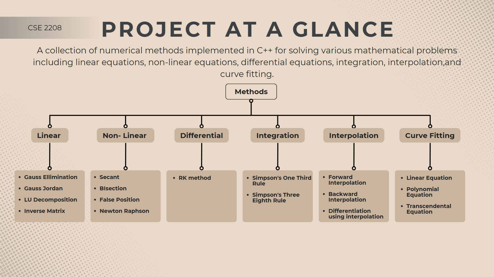

# Numerical Methods Project

A collection of numerical methods implemented in C++ for solving various mathematical problems including linear equations, non-linear equations, interpolation, integration, differential equations, and curve fitting.

---

## Table of Contents

1. [Non-Linear Equations](#non-linear-equations)
2. [Linear Equations](#linear-equations)
3. [Interpolation Methods](#interpolation-methods)
4. [Integration Methods](#integration-methods)
5. [Differential Equations](#differential-equations)
6. [Curve Fitting - Regression](#curve-fitting---regression)

---

## Non-Linear Equations

Methods for finding roots of equations of the form f(x) = 0.

| Method | Theory | Code | Input | Output |
|--------|--------|------|-------|--------|
| **Bisection Method** | [View](Non%20-%20Linear%20Equations/BIsection%20Method/README.md#theory) | [View](Non%20-%20Linear%20Equations/BIsection%20Method/Code/code.cpp) | [View](Non%20-%20Linear%20Equations/BIsection%20Method/Input/input.txt) | [View](Non%20-%20Linear%20Equations/BIsection%20Method/Output/output.txt) |
| **False Position Method** | [View](Non%20-%20Linear%20Equations/False%20Position%20Method/README.md#theory) | [View](Non%20-%20Linear%20Equations/False%20Position%20Method/Code/code.cpp) | [View](Non%20-%20Linear%20Equations/False%20Position%20Method/Input/input.txt) | [View](Non%20-%20Linear%20Equations/False%20Position%20Method/Output/output.txt) |
| **Newton Raphson Method** | [View](Non%20-%20Linear%20Equations/Newton%20Raphson%20Method/README.md#theory) | [View](Non%20-%20Linear%20Equations/Newton%20Raphson%20Method/Code/code.cpp) | [View](Non%20-%20Linear%20Equations/Newton%20Raphson%20Method/Input/input.txt) | [View](Non%20-%20Linear%20Equations/Newton%20Raphson%20Method/Output/output.txt) |
| **Secant Method** | [View](Non%20-%20Linear%20Equations/Secant%20Method/README.md#theory) | [View](Non%20-%20Linear%20Equations/Secant%20Method/Code/code.cpp) | [View](Non%20-%20Linear%20Equations/Secant%20Method/Input/input.txt) | [View](Non%20-%20Linear%20Equations/Secant%20Method/Output/output.txt) |

---

## Linear Equations

Methods for solving systems of linear equations (AX = B).

| Method | Theory | Code | Input | Output |
|--------|--------|------|-------|--------|
| **Gauss Elimination Method** | [View](Linear%20Equations/Gauss%20Ellimination%20Method/README.md#theory) | [View](Linear%20Equations/Gauss%20Ellimination%20Method/Code/code.cpp) | [View](Linear%20Equations/Gauss%20Ellimination%20Method/Input/input.txt) | [View](Linear%20Equations/Gauss%20Ellimination%20Method/Output/output.txt) |
| **Gauss Jordan Method** | [View](Linear%20Equations/Gauss%20Jordan%20Method/README.md#theory) | [View](Linear%20Equations/Gauss%20Jordan%20Method/Code/code.cpp) | [View](Linear%20Equations/Gauss%20Jordan%20Method/Input/input.txt) | [View](Linear%20Equations/Gauss%20Jordan%20Method/Output/output.txt) |
| **LU Decomposition Method** | [View](Linear%20Equations/LU%20Decomposition%20Method/README.md#theory) | [View](Linear%20Equations/LU%20Decomposition%20Method/Code/code.cpp) | [View](Linear%20Equations/LU%20Decomposition%20Method/Input/input.txt) | [View](Linear%20Equations/LU%20Decomposition%20Method/Output/output.txt) |
| **Inverse Matrix Method** | [View](Linear%20Equations/Inverse%20Matrix%20Method/README.md#theory) | [View](Linear%20Equations/Inverse%20Matrix%20Method/Code/code.cpp) | [View](Linear%20Equations/Inverse%20Matrix%20Method/Input/input.txt) | [View](Linear%20Equations/Inverse%20Matrix%20Method/Output/output.txt) |

---

## Interpolation Methods

Methods for estimating values between known data points.

| Method | Theory | Code | Input | Output |
|--------|--------|------|-------|--------|
| **Newton's Forward & Backward Interpolation** | [View](Interpolation%20methods/Newton's%20Interpolation/README.md#theory) | [View](Interpolation%20methods/Newton's%20Interpolation/Code/code.cpp) | [View](Interpolation%20methods/Newton's%20Interpolation/Input/input.txt) | [View](Interpolation%20methods/Newton's%20Interpolation/Output/output.txt) |
| **Differentiation using Newton's Interpolation** | [View](Interpolation%20methods/Differentiation%20using%20Newton's%20interpolation%20method/README.md#theory) | [View](Interpolation%20methods/Differentiation%20using%20Newton's%20interpolation%20method/Code/code.cpp) | [View](Interpolation%20methods/Differentiation%20using%20Newton's%20interpolation%20method/Input/input.txt) | [View](Interpolation%20methods/Differentiation%20using%20Newton's%20interpolation%20method/Output/output.txt) |

---

## Integration Methods

Numerical methods for finding definite integrals.

| Method | Theory | Code | Input | Output |
|--------|--------|------|-------|--------|
| **Simpson's 1/3 Rule** | [View](Integration/Simpson's%20One%20Third%20Rule/README.md#theory) | [View](Integration/Simpson's%20One%20Third%20Rule/Code/code.cpp) | [View](Integration/Simpson's%20One%20Third%20Rule/Input/input.txt) | [View](Integration/Simpson's%20One%20Third%20Rule/Output/output.txt) |
| **Simpson's 3/8 Rule** | [View](Integration/Simpson's%20Three%20Eighth%20Rule/README.md#theory) | [View](Integration/Simpson's%20Three%20Eighth%20Rule/Code/code.cpp) | [View](Integration/Simpson's%20Three%20Eighth%20Rule/Input/input.txt) | [View](Integration/Simpson's%20Three%20Eighth%20Rule/Output/output.txt) |

---

## Differential Equations

Methods for solving ordinary differential equations (ODEs).

| Method | Theory | Code | Input | Output |
|--------|--------|------|-------|--------|
| **Runge-Kutta Method (RK4)** | [View](Differentiatial%20Equation/RK%20method/README.md#theory) | [View](Differentiatial%20Equation/RK%20method/Code/code.cpp) | [View](Differentiatial%20Equation/RK%20method/Input/input.txt) | [View](Differentiatial%20Equation/RK%20method/Output/output.txt) |

---

## Curve Fitting - Regression

Least square regression methods for fitting curves to experimental data.

| Type | Theory | Code | Input | Output |
|------|--------|------|-------|--------|
| **Linear Equation** | [View](Curve%20Fitting%20-%20Regression/README.md#theory) | [View](Curve%20Fitting%20-%20Regression/Linear%20Equation/Code/code.cpp) | [View](Curve%20Fitting%20-%20Regression/Linear%20Equation/Input/input.txt) | [View](Curve%20Fitting%20-%20Regression/Linear%20Equation/Output/output.txt) |
| **Polynomial Equation** | [View](Curve%20Fitting%20-%20Regression/README.md#theory-1) | [View](Curve%20Fitting%20-%20Regression/Polynomial%20Equation/Code/code.cpp) | [View](Curve%20Fitting%20-%20Regression/Polynomial%20Equation/Input/input.txt) | [View](Curve%20Fitting%20-%20Regression/Polynomial%20Equation/Output/output.txt) |
| **Transcendental Equation** | [View](Curve%20Fitting%20-%20Regression/README.md#theory-2) | [View](Curve%20Fitting%20-%20Regression/Transcendental%20Equation/Code/code.cpp) | [View](Curve%20Fitting%20-%20Regression/Transcendental%20Equation/Input/input.txt) | [View](Curve%20Fitting%20-%20Regression/Transcendental%20Equation/Output/output.txt) |

---

## Project Structure

---

## Common Structure

Each method folder contains:

- **README.md**: Complete theory, algorithm, examples, and constraints
- **Code/**: C++ implementation of method
- **Input/**: Sample input files
- **Output/**: Sample output files

---

## Input/Output Pattern

All methods follow a consistent file I/O pattern (using file handling):
- **Input**: Read from `../Input/input.txt`
- **Output**: Write to `../Output/output.txt`

---

## Project Members
| Name | Roll | Year | Term | Group |
|------|------|------|------|-------|
| Md. Taki Tahmid Saad | 2207022 | 2nd | 2nd | A1 |
| Saleh Sadid Mir | 2207024 | 2nd | 2nd | A1 |
| Md Sadikul Islam Siyam | 2207031 | 2nd | 2nd | A2 |
